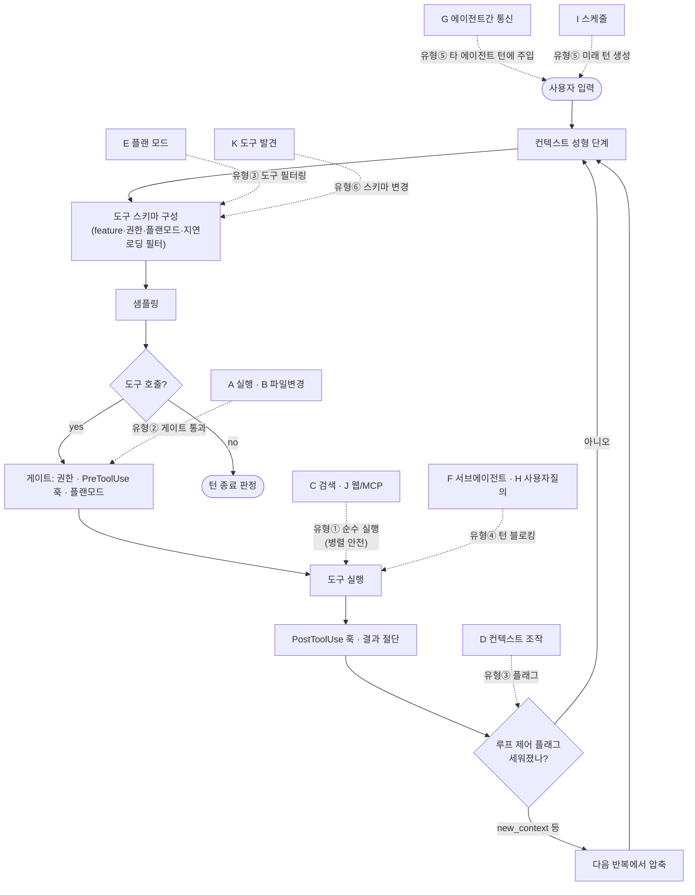

# 도구 카테고리 × 턴루프 구조 분석

에이전트별 나열([README.md](README.md), 개별 문서)을 **카테고리 축으로 재정리**하고, 각 카테고리가 **턴루프의 어느 지점에서 어떤 구조로 작동하는지**를 실제 코드 근거와 함께 정리한다.

핵심 발견: 도구는 "모델이 부르는 함수"가 아니다. **카테고리마다 루프와 맺는 관계가 다르다** — 어떤 것은 단순 실행이고, 어떤 것은 루프 제어 플래그를 세우며, 어떤 것은 도구 세트 자체를 바꾸고, 어떤 것은 미래의 턴을 만든다.

---

## 0. 루프 상호작용 5분류

| 유형 | 의미 | 대표 카테고리 |
|---|---|---|
| **① 순수 실행** | 결과만 반환, 루프에 영향 없음 | 파일 읽기, 검색, 웹 |
| **② 게이트 통과형** | 실행 전 승인/훅을 반드시 거침 | 실행(셸), 파일 변경 |
| **③ 루프 제어형** | 플래그를 세워 **다음 반복의 루프 동작을 바꿈** | 컨텍스트 조작, 플랜 모드 |
| **④ 루프 정지형** | 도구 안에서 **턴을 블로킹**하고 외부 응답을 기다림 | 사용자 질의, 서브에이전트 대기 |
| **⑤ 턴 생성형** | 현재 턴 밖에서 **새 턴을 발생**시킴 | 스케줄, 에이전트 간 통신 |

여기에 **도구 세트 자체를 바꾸는** 메타 카테고리(⑥)가 별도로 있다 — 지연 로딩(ToolSearch).

---

## A. 실행 (Execution) — 유형 ②

셸/명령 실행. 모든 구현이 갖는 유일한 필수 카테고리.

| 에이전트 | 도구 |
|---|---|
| codex | `exec_command` + `write_stdin`(세션형) / `shell_command`(단발) |
| openclaude | `Bash`, `PowerShell`, `REPL` |
| qwen-code | `run_shell_command` |
| opencode | `shell` |
| mistral-vibe | `bash` (+ `experimental_bash` 교체 가능) |
| zai-glm-cli | `bash` |

### 턴루프 구조
도구 실행 단계에서 **승인 게이트를 반드시 통과**한다. 구현별 기전이 다르다:

- **codex**: 핸들러가 `request_command_approval`(session/mod.rs:2168) 호출 → oneshot 채널을 turn_state에 등록 → `ExecApprovalRequest` 이벤트 발행 → **`rx_approve.await`로 블로킹** → submission_loop이 `Op::ExecApproval`을 받아 `notify_approval`로 해제. 즉 실행 도구는 ②이면서 실질적으로 ④(정지)이기도 하다.
- **qwen-code**: 스케줄러 L3→L4→L5(coreToolScheduler.ts:2312~)에서 `ask`면 `awaiting_approval` 상태로 전이해 대기.
- **mistral-vibe**: `sensitive_patterns`가 `permission=ALWAYS`여도 ASK로 승격 — "bash는 허용하되 위험 명령만 확인".
- **zai-glm-cli**: 도구 구현부의 `ConfirmationTool`이 자체 확인. 루프 레벨 게이트 없음.

**세션형 vs 단발형**이 갈린다. codex만 `exec_command`+`write_stdin` 쌍으로 장기 실행 프로세스에 stdin을 주입할 수 있어, 대화형 프로세스를 여러 턴에 걸쳐 유지한다.

---

## B. 파일 조작 (File Mutation) — 유형 ②

| 에이전트 | 읽기 | 쓰기 | 편집 | 특수 |
|---|---|---|---|---|
| codex | *(shell로)* | *(apply_patch)* | `apply_patch` | 전용 lark 문법 파서 |
| openclaude | `Read` | `Write` | `Edit` | `NotebookEdit` |
| qwen-code | `read_file` | `write_file` | `edit` | `notebook_edit` |
| opencode | `read` | `write` | `edit`, `patch` | — |
| mistral-vibe | `read_file` | `write_file` | `edit` | — |
| zai-glm-cli | `view_file` | `create_file` | `str_replace_editor`, `edit_file`(Morph), `batch_edit` | 일괄 편집 |

**codex는 읽기 전용 파일 도구가 없다** — 읽기·검색을 전부 shell에 위임하고 변경만 `apply_patch`로 처리한다. 도구 수를 줄이는 대신 권한·병렬성·결과 크기 제어가 셸 안쪽으로 밀려난다.

### 턴루프 구조 — 도구 간 상태 의존
qwen-code는 **"편집 전 읽기 강제"**를 구현한다(`priorReadEnforcement.ts`, `checkPriorRead`). 파일마다 `lastReadAt`/`lastReadCacheable`을 추적해, 사전 읽기 없이 `edit`/`write`를 호출하면 `StructuredToolError`로 거부한다. 주석에 따르면 Claude Code의 `readFileState`와 정렬된 정책이며, 절단된 부분 읽기도 "읽음"으로 인정한다(truncate 한계 때문에 "완전히 읽음"이 불가능하므로).

이는 **카테고리 C(검색/읽기)의 결과가 카테고리 B(변경)의 실행 가능 여부를 결정**하는 교차 의존이다. 루프 관점에서는 한 턴 안의 도구 호출들이 서로 순서 제약을 갖는다는 뜻.

---

## C. 탐색·검색 (File Search) — 유형 ①

"검색"의 첫 번째 의미. 순수 읽기라 대부분 **병렬 안전**으로 분류된다.

| 에이전트 | 패턴 매칭 | 내용 검색 | 목록 |
|---|---|---|---|
| codex | *(shell)* | *(shell)* | *(shell)* |
| openclaude | `Glob` | `Grep` | — |
| qwen-code | `glob` | `grep_search` (ripGrep 백엔드) | `list_directory` |
| opencode | `glob` (Ripgrep) | `grep` | — |
| mistral-vibe | — | `grep` | — |
| zai-glm-cli | `search` (통합: type/pattern/regex/file_types/hidden 옵션) | 〃 | — |

### 턴루프 구조 — 병렬성 판정의 근거
- **qwen-code**: `CONCURRENCY_SAFE_KINDS = {Read, Search, Fetch}`(tools.ts:962). 분류가 곧 병렬 정책.
- **openclaude**: 도구마다 `isConcurrencySafe(input)` 개별 선언. 추가로 `isSearchOrReadCommand()`가 UI에서 접어 표시할지를 결정.
- **mistral-vibe / zai-glm-cli**: 병렬 안전 개념이 없어, 전자는 전부 동시 실행, 후자는 전부 순차.

**openclaude의 조건부 제외**가 흥미롭다: ant 네이티브 빌드는 bfs/ugrep가 셸에 임베드돼 있어 `Glob`/`Grep` 도구를 아예 등록하지 않는다(tools.ts:191) — 셸이 충분히 빠르면 전용 도구가 불필요하다는 판단.

---

## D. 컨텍스트 조작 (Context Manipulation) — 유형 ③ ★

**도구가 루프 제어 플래그를 세우는** 카테고리. 가장 구조적으로 흥미롭다.

| 에이전트 | 도구 |
|---|---|
| codex | `new_context`(압축 트리거), `get_context_remaining` |
| openclaude | `snip`(히스토리 절제), `CtxInspect` |
| qwen-code | `save_memory` |
| opencode | — |
| mistral-vibe | — |
| zai-glm-cli | — |

### 턴루프 구조 — 플래그 세우기 → 루프가 소비
codex의 `new_context`가 정본이다:

```
new_context 도구 호출
  → session.request_new_context_window()          (session/mod.rs:3509)
  → state.new_context_window_requested = true     (auto_compact_window.rs:95)

... 도구 실행 완료, 루프가 다음 반복으로 ...

run_turn 루프 (turn.rs:343):
  should_roll_over = needs_follow_up && (take_new_context_window_request() || token_limit_reached)
  if should_roll_over → run_auto_compact(MidTurn) → continue
```

즉 **도구는 압축을 직접 실행하지 않는다.** 플래그만 세우고, 루프가 다음 반복 시작 시 `take_new_context_window_request()`로 **소비(take = 읽고 false로 리셋)**해 중간 압축을 수행한다. 도구가 루프의 제어 흐름에 개입하는 정석적 패턴이며, one-shot 소비라 중복 압축이 방지된다.

openclaude의 `snip`도 유사하게 히스토리 성형 파이프라인(§3의 4층 압축)에 개입한다.

---

## E. 계획·상태 (Planning & State) — 유형 ①/③

| 에이전트 | 할일·계획 | 플랜 모드 |
|---|---|---|
| codex | `update_plan` | *(mode 설정)* |
| openclaude | `TodoWrite`, `TaskCreate/Get/Update/List` | `EnterPlanMode`, `ExitPlanMode` |
| qwen-code | `todo_write`, `task_create/update/list/stop` | `enter_plan_mode`, `exit_plan_mode` |
| opencode | `todo` | `plan`(이탈) |
| mistral-vibe | `todo` | `exit_plan_mode` |
| zai-glm-cli | `create_todo_list`, `update_todo_list` | 없음 |

### 턴루프 구조 — 플랜 모드는 도구 필터가 된다 ★
플랜 모드는 단순 상태가 아니라 **다른 카테고리 전체를 차단하는 게이트**다.

- **openclaude — 기계적 읽기전용 정책**(`permissions.ts:1401~1447`): 플랜 모드에서 각 도구는 `tool.isReadOnly(parsed.data)`로 판정되고, false면 `planModeDenial`("Plan mode is read-only. Exit plan mode before using X"). 인자 파싱이 실패해도 deny(안전측 기본값). **MCP 도구는 서버 제공 이름을 신뢰하지 않고 오직 `readOnlyHint` 기반 `isReadOnly()`로만 분류**한다(1438~1442) — 서버가 이름으로 내장 예외를 위장하는 것을 차단. 게다가 훅 실행 중·승인 정규화 후·업데이트 커밋 경계에서 **플랜 모드를 재확인**해, 검사 도중 플랜 모드에 진입해도 변경이 새지 않는다.
- **qwen-code**: 스케줄러가 `isPlanModeBlocked`(coreToolScheduler.ts:2575)로 차단하고 `TOOL_FAILURE_KIND_PLAN_MODE_BLOCKED`로 마킹. 팀 워커는 리더 승인 전까지 사전승인 도구(`EXIT_PLAN_MODE`, `TASK_UPDATE` 등)만 통과(2355~2379).

즉 카테고리 E가 카테고리 A·B를 **런타임에 무력화**한다. 이 판정의 근거가 카테고리 C의 메타 속성(`isReadOnly`)이라는 점이 설계의 연결고리다.

---

## F. 오케스트레이션 (Subagent) — 유형 ④

| 에이전트 | 도구 |
|---|---|
| codex | `spawn_agent`, `wait_agent`, `send_input`, `send_message`, `followup_task`, `resume_agent`, `interrupt_agent`, `close_agent`, `list_agents`, `spawn_agents_on_csv`, `report_agent_job_result` |
| openclaude | `Agent`(별칭 `Task`), `TaskOutput`, `TaskStop` |
| qwen-code | `agent`, `create_sub_session` |
| opencode | `task` |
| mistral-vibe | `task` |
| zai-glm-cli | (TaskTool) + TaskOrchestrator |

### 턴루프 구조 — 대기의 두 철학
- **블로킹 대기(codex)**: `wait_agent`(wait.rs:52)가 자식마다 `subscribe_status`로 watch 채널을 구독하고 `FuturesUnordered` + `timeout_at(deadline)`으로 **턴을 도구 호출 안에서 정지**시킨다. 명시적 타임아웃과 부분 수집(먼저 끝난 것만) 로직 보유.
- **인라인 await(opencode/mistral-vibe/zai)**: 부모의 도구 실행이 자식 루프를 그냥 기다린다. opencode의 `handleSubtask`(prompt.ts:255)는 `taskTool.execute`를 await하고, 권한은 `Permission.merge(taskAgent, session)`로 **부모 규칙을 상속**시킨다(346).
- **제너레이터 위임(openclaude)**: `runAgent`가 자식 `query` 루프를 `querySource:'agent:…'`로 돌리고 부모가 소비.

codex만 spawn과 wait가 **분리**돼 있어, 자식을 띄워놓고 다른 작업을 하다 나중에 대기하는 비동기 패턴이 가능하다.

---

## G. 에이전트 간 통신 (Inter-agent) — 유형 ⑤

| 에이전트 | 도구 |
|---|---|
| codex | `send_message`, `send_input` → mailbox |
| openclaude | `SendMessage`, `TeamCreate`, `TeamDelete`, `ListPeers` |
| qwen-code | `send_message`, `team_create/delete`, `team_plan_approval` |
| opencode / mistral-vibe / zai-glm-cli | **없음** |

### 턴루프 구조 — 메시지가 다음 턴의 입력이 된다
- **openclaude(스웜)**: `SendMessage`가 **파일 메일박스**(`~/.claude/teams/{team}/inboxes/{agent}.json`)에 기록한다. 수신자 루프는 두 경로로 흡수: ① 일반 메시지는 `getTeammateMailboxAttachments`(attachments.ts:3871)가 반복 시작부에서 attachment로 주입, ② 권한요청·플랜승인·shutdown 같은 **구조 프로토콜 메시지**는 attachment가 일부러 건드리지 않고 `useInboxPoller`가 전용 큐로 라우팅(LLM 컨텍스트 오염 방지). 수신자가 idle로 죽지 않게 `TeammateIdle` 훅이 blockingError로 루프를 연장한다.
- **codex**: `InterAgentCommunication`이 `InputQueue`의 mailbox 계층으로 들어가고, `MailboxDeliveryPhase`가 "이번 턴 수락 vs 다음 턴 연기"를 제어. `trigger_turn` 플래그 메일은 **새 턴을 발생**시킨다.

즉 이 카테고리의 도구는 **다른 에이전트의 턴루프에 입력을 주입**하는 것이 본질이다.

---

## H. 사용자 상호작용 (User Interaction) — 유형 ④

| 에이전트 | 도구 |
|---|---|
| codex | `request_user_input`(DirectModelOnly) |
| openclaude | `AskUserQuestion`, `Brief`, `SendUserFile`, `PushNotification` |
| qwen-code | `ask_user_question` |
| opencode | `question`(게이트) |
| mistral-vibe | `ask_user_question` |
| zai-glm-cli | 없음 |

### 턴루프 구조
승인 게이트와 **동일한 요청-응답 기전**을 쓴다. codex는 `Op::UserInputAnswer`가 submission_loop로 들어와 대기를 해제한다. 즉 승인(A/B 카테고리의 부수 효과)과 질의(H의 본체)는 구현상 같은 채널이다.

---

## I. 자가 턴·스케줄 (Self-turn & Scheduling) — 유형 ⑤ ★

**모델이 미래의 턴을 예약**하는 카테고리. 자가 턴 발생 장치를 도구로 노출할지가 갈린다.

| 에이전트 | 도구 |
|---|---|
| qwen-code | `cron_create/list/delete`, **`loop_wakeup`**, `monitor`, `workflow` |
| openclaude | `CronCreate/Delete/List`, `Monitor`, `RemoteTrigger`, `Sleep`, `WorkflowTool` |
| codex | `sleep`(대기만), `wait_for_environment` |
| opencode / mistral-vibe / zai-glm-cli | **없음** |

### 턴루프 구조
qwen-code의 `loop_wakeup`(loop-wakeup.ts:86)이 `scheduler.scheduleWakeup(delaySeconds, prompt)`를 호출하면, 지정 시각에 **`SendMessageType.Cron` 타입의 top-level 턴**이 발생한다. 턴루프 문서에서 본 "기계 발생 턴"(Cron/Notification/Teammate)의 생산자가 바로 이 카테고리다.

주석에 따르면 `loop_wakeup`은 CronCreate와 **동일한 분류기 검증**을 받는다(56, 169) — 임의 프롬프트로 미래 실행을 예약하는 것은 직접 명령과 같은 수준의 위험이라는 판단.

mistral-vibe는 같은 기능을 **도구가 아니라 세션 밖 `/loop` 스케줄러**(core/loop.py, 최대 50개·최소 30초)로 둔다 — 모델이 아니라 사용자가 제어한다는 설계 차이.

---

## J. 외부 세계 (External World) — 유형 ①/②

"검색"의 두 번째 의미(웹 검색).

| 에이전트 | 웹 | MCP |
|---|---|---|
| codex | *(호스티드 web search)* | `list_mcp_resources`, `list_mcp_resource_templates`, `read_mcp_resource` + 동적 `mcp__*` |
| openclaude | `WebFetch`, `WebSearch`, `WebBrowser` | `ListMcpResourcesTool`, `ReadMcpResourceTool`, `mcp`, `McpAuthTool` |
| qwen-code | `web_fetch` | `read_mcp_resource` + **풀/예산/재시도/타임아웃 분리** |
| opencode | `fetch`, `search` | MCP 서비스 + `McpCatalog` |
| mistral-vibe | `web_fetch`, `web_search` | MCP 풀 + 스킬 의존성 자동 설치 제안 |
| zai-glm-cli | **없음** | MCPManager |

### 턴루프 구조
- MCP 도구는 **턴 시작 시 동적으로 편입**된다. codex는 `built_tools`가 매 샘플링마다 `list_all_tools()`로 MCP 인벤토리를 조회해 라우터를 재구성한다.
- openclaude는 MCP 도구에 `isOpenWorld`·`mcpInfo`를 달고, **플랜 모드에서 서버 제공 이름을 불신**하고 `readOnlyHint` 기반 `isReadOnly()`로만 판정한다(§E).
- qwen-code의 MCP 인프라가 가장 성숙: 연결 풀(`mcp-transport-pool.ts`), 워크스페이스 예산(`mcp-workspace-budget.ts`), 재시도(`mcp-retry.ts`), 디스커버리 타임아웃(`mcp-discovery-timeout.ts`)이 각각 분리.

---

## K. 메타·도구 발견 (Tool Discovery) — 유형 ⑥ ★★

"검색"의 세 번째 의미이자 **가장 구조적인 카테고리**: 도구가 도구 세트를 바꾼다.

| 에이전트 | 도구 |
|---|---|
| codex | `tool_search` |
| openclaude | `ToolSearch` (+ `Skill`, `DiscoverSkills`) |
| qwen-code | `tool_search` (+ `skill`) |
| opencode / mistral-vibe / zai-glm-cli | **없음** |

### 턴루프 구조 — 턴 안에서 도구 세트가 커진다
openclaude 구현이 명확하다(`services/api/claude.ts:1219~1343`):

```
deferredToolNames = 도구 중 isDeferredTool(t)인 것들의 집합
if 지연 도구가 없으면 → tool search 비활성 (1226~1235)

요청 스키마 구성 시:
  비-지연 도구는 항상 포함                     (1251~1252)
  지연 도구는 "발견된 것만" 포함               (1245~1255)
  defer_loading 베타 헤더 추가                 (1264)
로그: "Dynamic tool loading: N/M deferred tools included"  (1343)
```

즉 **같은 턴의 반복마다 모델에 보내는 도구 스키마가 달라진다.** 모델이 `ToolSearch`로 도구를 찾으면 그 도구가 다음 반복부터 스키마에 포함된다. 이를 뒷받침하는 도구 메타 속성이 `shouldDefer`(지연 대상), `alwaysLoad`(항상 노출 — 1턴차에 반드시 보여야 하는 것), `searchHint`(키워드 매칭용 3~10단어, 도구명에 없는 용어 권장 예: NotebookEdit엔 'jupyter')다.

**도입 조건이 명확하다**: 도구 50+개(openclaude), ~30개 동적(codex), 37+CU 35개(qwen-code)를 가진 구현만 이 카테고리를 갖는다. 16개 이하(opencode·mistral-vibe·zai)는 전부 상시 노출로 충분하다. 즉 K는 도구 수 팽창의 **필연적 대응**이다.

---

## L. 환경 격리 (Environment Isolation) — 유형 ③

| 에이전트 | 도구 |
|---|---|
| openclaude | `EnterWorktree`, `ExitWorktree` |
| qwen-code | `enter_worktree`, `exit_worktree` |
| codex | `wait_for_environment` (원격 환경 준비 대기) |
| 나머지 | 없음 |

### 턴루프 구조
worktree 진입은 **이후 모든 실행·파일 도구의 작업 디렉토리를 바꾼다**. codex는 여기서 더 나아가 `environment_id` 파라미터를 exec/apply_patch/view_image에 넣어(`ToolEnvironmentMode::Multiple`) **다중 환경을 한 턴에서 동시 조작**한다. 환경이 없으면(`has_environment()` false) 해당 카테고리 도구가 통째로 등록에서 빠진다.

---

## 카테고리 × 루프 단계 매핑



---

## 카테고리별 요구 게이트 매트릭스

| 카테고리 | 승인 | 훅 | 플랜모드 차단 | 병렬 안전 | 결과 절단 |
|---|---|---|---|---|---|
| A 실행 | **필수** | Pre/Post | **차단** | ✗ | 필요 |
| B 파일 변경 | **필수** | Pre/Post | **차단** | ✗ | — |
| C 검색·읽기 | 보통 불필요 | Pre/Post | 허용 | **○** | 필요 |
| D 컨텍스트 조작 | 불필요 | — | 허용 | ✗ | — |
| E 계획·상태 | 불필요 | — | 허용(전용) | ✗ | — |
| F 서브에이전트 | 구현별 | Subagent 훅 | 보통 차단 | ✗ | 필요 |
| G 에이전트간 통신 | 구현별 | — | 차단 경향 | ✗ | — |
| H 사용자 질의 | (자체가 질의) | — | 허용 | ✗ | — |
| I 스케줄 | **필수**(분류기 검증) | — | 차단 | ✗ | — |
| J 웹·MCP | 구현별 | Pre/Post | `isReadOnly` 판정 | **○**(Fetch) | 필요 |
| K 도구 발견 | 불필요 | — | 허용 | ○ | — |
| L 환경 격리 | 구현별 | — | 차단 | ✗ | — |

---

## 종합: 카테고리 보유 현황

| 카테고리 | codex | openclaude | qwen-code | opencode | mistral-vibe | zai |
|---|---|---|---|---|---|---|
| A 실행 | ●● | ●●● | ● | ● | ●● | ● |
| B 파일 변경 | ●(patch만) | ●●● | ●●● | ●● | ●● | ●●● |
| C 검색 | ✗(shell) | ●● | ●●● | ●● | ● | ●(통합) |
| D 컨텍스트 조작 | ●● | ●● | ● | ✗ | ✗ | ✗ |
| E 계획·플랜 | ● | ●●● | ●●● | ●● | ●● | ● |
| F 서브에이전트 | ●●● | ●● | ●● | ● | ● | ● |
| G 에이전트간 통신 | ●● | ●●● | ●● | ✗ | ✗ | ✗ |
| H 사용자 질의 | ● | ●●● | ● | ● | ● | ✗ |
| I 스케줄 | ●(sleep) | ●●● | ●●● | ✗ | ✗ | ✗ |
| J 외부세계 | ●● | ●●● | ●● | ●● | ●● | ●(MCP만) |
| K 도구 발견 | ● | ●● | ● | ✗ | ✗ | ✗ |
| L 환경 격리 | ●●(다중환경) | ● | ● | ✗ | ✗ | ✗ |

**해석**: 왼쪽 3개(codex·openclaude·qwen-code)는 12개 카테고리를 거의 다 갖고, 오른쪽 3개는 A~C·E~F·J의 핵심만 갖는다. 갈리는 지점은 **D(컨텍스트 조작)·G(통신)·I(스케줄)·K(도구 발견)** — 이 넷은 모두 "도구가 루프 자체에 개입"하는 유형(③⑤⑥)이며, 턴루프가 복잡한 구현에서만 나타난다.

즉 **도구 카테고리의 확장은 턴루프 복잡도의 함수**다. 루프에 개입 계층(훅·큐·압축·자가턴)이 있어야 그 계층을 조작하는 도구가 존재할 수 있다.
