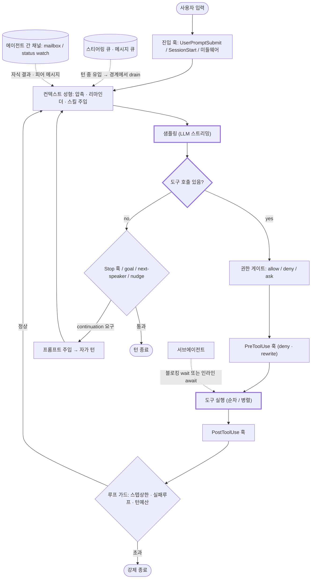

# 코딩 에이전트 턴루프(Turn Loop) 분석

`reference/` 에 클론한 각 오픈소스 코딩 에이전트의 턴루프 구현을 소스 레벨에서 추적하여 정리한 문서 모음이다.
"턴루프"란 사용자 입력 1건이 들어온 뒤, LLM 샘플링 → 도구 실행 → 재샘플링을 반복하다가 최종 응답으로 턴을 종료할 때까지의 제어 흐름을 말한다.

## 조사 대상 및 레포 매핑

| 요청 이름 | 실제 레포 | 언어 | 문서 |
|---|---|---|---|
| codex | [openai/codex](https://github.com/openai/codex) | Rust | [codex.md](codex.md) |
| openclaude | [Gitlawb/openclaude](https://github.com/Gitlawb/openclaude) (Claude Code 계보의 오픈소스 포크) | TypeScript | [openclaude.md](openclaude.md) |
| qwencode | [QwenLM/qwen-code](https://github.com/QwenLM/qwen-code) (gemini-cli 계보) | TypeScript | [qwen-code.md](qwen-code.md) |
| mistral code | [mistralai/mistral-vibe](https://github.com/mistralai/mistral-vibe) — "Mistral Code" 제품 자체는 Continue 기반 비공개 엔터프라이즈 제품이며, Mistral의 공식 공개 CLI 에이전트는 mistral-vibe | Python | [mistral-vibe.md](mistral-vibe.md) |
| glm code | [guizmo-ai/zai-glm-cli](https://github.com/guizmo-ai/zai-glm-cli) — Z.ai(Zhipu) 공식 조직(zai-org)에는 공개 CLI 에이전트 레포가 없음(GLM Coding Plan은 Claude Code 등 타사 도구에 모델만 연결). grok-cli를 포크한 커뮤니티 구현체를 대상으로 함 | TypeScript | [zai-glm-cli.md](zai-glm-cli.md) |
| opencode | [sst/opencode](https://github.com/sst/opencode) | TypeScript (Effect) | [opencode.md](opencode.md) |
| claim | **GitHub에서 해당 이름의 코딩 에이전트를 찾지 못함.** 검색 결과 "claim"이라는 이름의 CLI 코딩 에이전트는 존재하지 않으며, 유사 명칭 레포(claimcheck, cngx, musts)는 모두 "에이전트가 주장(claim)한 작업을 검증하는 도구"였다. Cline 등의 오기일 가능성이 있음 | — | (클론 없음) |

## 구조 비교 요약

| 항목 | codex | openclaude | qwen-code | opencode | mistral-vibe | zai-glm-cli |
|---|---|---|---|---|---|---|
| 루프 형태 | `run_turn` 내 `loop` + 별도 submission 루프 | 단일 거대 `while(true)` + 상태 구조체 | **재귀 async generator** (`sendMessageStream`이 자신을 yield*) | 메시지 로그 재해석 `while(true)` | `while not should_break` | `while rounds < max` |
| 도구 승인 게이트 | approval policy + `Op::ExecApproval/PatchApproval` (비동기 응답 대기) | `canUseTool` 콜백 + permission denied 훅 | MessageBus 승인 + PreToolUse 훅 | Permission rule (allow/deny/ask) 서비스 | permission store + approval callback (always/never/ask) | ConfirmationTool (파일/배시만) |
| 라이프사이클 훅 | 11종 (PreToolUse~Stop, Subagent*) | Stop/TaskCompleted/TeammateIdle/PreToolUse/PostToolUse/PermissionDenied 등 | UserPromptSubmit/Stop/SessionStart 등 MessageBus 경유 | plugin.trigger 이벤트 | pre_tool / post_tool / post_agent 3종 | 없음 (React 훅뿐) |
| Stop 훅/goal에 의한 자가 턴 | Stop 훅 block → continuation 메시지 주입 후 루프 지속 | Stop 훅 blocking + goal 평가 + continuation nudge + token budget continuation | Stop 훅 blocking(cap 존재) + `/goal` + next-speaker check("Please continue.") | 없음 (메시지 로그 기반이라 새 user 메시지로만) | post_agent 훅이 retry 메시지 큐잉 | 없음 |
| 스티어링(턴 도중 사용자 입력) | `InputQueue` (steer + agent 간 mailbox 2계층) | 우선순위 커맨드 큐 (now/next/later) | `takeSteerInput` — accept/restore 정산 방식 | 메시지 DB에 append → 루프가 다음 반복에서 자연 흡수 | `inject_user_context` → pending injection drain | 없음 |
| 에이전트 간 통신 방식 | mailbox `InterAgentCommunication` → InputQueue (`MailboxDeliveryPhase`) | **파일 메일박스**(독립 피어 세션) + AppState.inbox | Teammate envelope(기계 발생 턴) + 리더-워커 승인 | 없음(부모-자식만) | 없음(부모-자식만) | 없음 |
| 서브에이전트 대기 방식 | **블로킹** `wait_agent`(status watch 채널 + deadline) | **폴+attachment 주입 + idle 훅 생존**(non-blocking); 부모-자식은 AgentTool await | 부모 Task 도구 await + SubagentStart/Stop 훅 | `handleSubtask` **인라인 await**(권한 병합 상속) | task 도구 인라인 await (중첩 AgentLoop) | TaskOrchestrator `Promise.all` 병렬 await |
| 컴팩션 | pre-turn/mid-turn 자동, 로컬/리모트/토큰버짓 3경로 | snip → microcompact → autocompact → context collapse 4층 | chat 내부 자동압축 + 압축 후 SessionStart(compact) 훅 재발화 | compaction 태스크를 큐에 넣고 루프가 처리 | ContextTooLong 시 self-heal 후 **같은 턴** 재시도(예산 미소모) | 없음 |
| 루프 폭주 방어 | 압축 실패 시 에러 종료, 훅 block 시 경고 | MAX_CONTINUATION_NUDGES, agentStepLimit, toolFailureLoopGuard, stop 훅 재진입 가드 | MAX_TURNS=100 예산 재귀 전파, loopDetector, stopHookBlockingCap | agent별 `steps` 상한 + MAX_STEPS_PROMPT + doom-loop 가드 | post_agent retry 카운터, /loop 상한(50개·30s) | maxToolRounds=400 |

## 관전 포인트

1. **루프의 "재료"가 무엇인가** — codex/openclaude/qwen-code는 메모리 내 상태(히스토리 + 상태 구조체)를 돌리고, opencode는 매 반복마다 **영속 메시지 로그를 다시 읽어 다음 행동을 유도**한다(compaction·subtask도 메시지 파트로 큐잉). 후자는 스티어링/재시작/크래시 복구가 공짜로 얻어지는 대신 매 스텝 DB 왕복이 필요하다.
2. **자가 턴 발생 계층** — 단순 구현(zai-glm-cli)은 tool_calls 유무로만 반복한다. 현대적 구현은 그 위에 (a) Stop 훅/goal이 종료를 거부하고 새 프롬프트를 주입, (b) 모델의 "계속하겠다" 발화를 감지한 nudge(openclaude), (c) LLM에게 다음 화자를 물어보는 next-speaker check(qwen-code), (d) 토큰 예산 기반 continuation(openclaude) 등이 겹겹이 쌓인다. 각 계층마다 **폭주 방지 cap**이 반드시 함께 붙는다는 점이 공통 패턴.
3. **스티어링 정산** — 턴 도중 유입된 입력은 "언제 히스토리에 넣을지"가 문제다. codex는 mailbox 수락 시점을 명시적 상태 기계(MailboxDeliveryPhase)로 관리하고, qwen-code는 steer 입력을 낙관적으로 소비한 뒤 실제로 히스토리에 반영됐는지 push 카운터로 검증해 accept/restore 한다.
4. **에이전트 간 "대기"의 두 철학** — 자식 결과를 기다리는 방식이 갈린다. **블로킹형**(codex `wait_agent`: 도구 호출이 status watch 채널을 deadline까지 블로킹; opencode/mistral-vibe/zai: 부모 도구가 자식 실행을 인라인 await)과 **비블로킹형**(openclaude 스웜: teammate는 독립 세션이고, 파일 메일박스 메시지를 폴+attachment로 흡수하며 idle 훅이 would-be-idle 워커를 살려 다음 메시지를 기다리게 함)이다. openclaude는 Claude Code의 스웜 모델을 승계해 권한·플랜승인·shutdown까지 메일박스 프로토콜 메시지로 주고받고, 이들은 LLM 컨텍스트가 아니라 인박스 폴러의 제어 평면으로 라우팅된다.

> 각 문서(`codex.md`, `openclaude.md`, `qwen-code.md`, `opencode.md`, `mistral-vibe.md`, `zai-glm-cli.md`)는 실제 소스의 `file:line`과 함께 12개 축(진입점·루프구성·반복파이프라인·샘플링·도구실행·게이트·종료조건·자가턴·스티어링·에이전트간통신/서브에이전트대기·이벤트·동시성)으로 상세 분석돼 있다.

---

## 공통 골격: 턴루프에 끼어드는 개입 계층

6개 구현을 관통하는 일반형. 굵은 경로가 "고전 루프"(zai-glm-cli는 이것만 있음)이고, 점선으로 붙은 것들이 현대 에이전트가 추가한 개입 계층이다.

| 계층 | 없는 구현 | 있는 구현 |
|---|---|---|
| 진입 훅 | zai-glm-cli | codex(SessionStart/UserPromptSubmit), qwen-code(MessageBus), mistral-vibe(미들웨어) |
| 권한 게이트 | zai-glm-cli(도구 내장만) | 나머지 전부 |
| Pre/Post 도구 훅 | zai-glm-cli, opencode(plugin으로 대체) | codex, openclaude, qwen-code, mistral-vibe |
| 자가 턴 | zai-glm-cli, opencode(의도적 배제) | codex, openclaude(3중), qwen-code(최다), mistral-vibe |
| 스티어링 큐 | zai-glm-cli | codex(2계층), openclaude(우선순위), qwen-code(정산), opencode(메시지로그), mistral-vibe(injection) |
| 에이전트 간 채널 | opencode, mistral-vibe, zai-glm-cli | codex(mailbox+watch), openclaude(파일 메일박스), qwen-code(Teammate envelope) |
| 컴팩션 | zai-glm-cli | 나머지 전부 |
