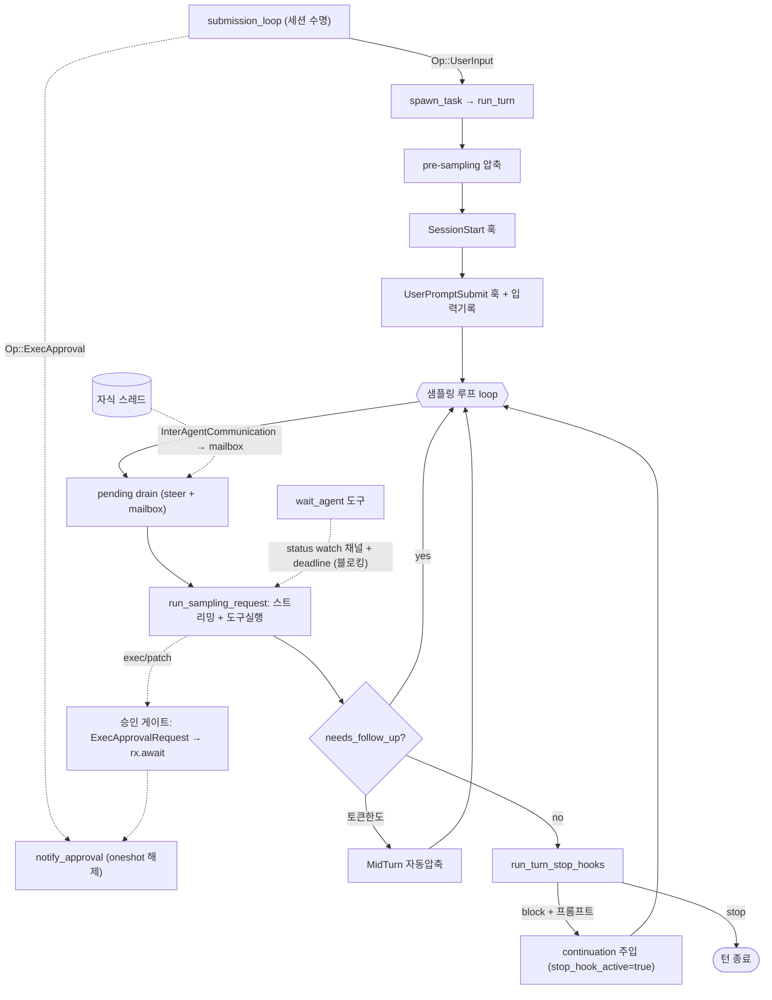

# codex (openai/codex) 턴루프 정밀 분석

Rust(tokio) 기반. 이벤트 소싱(`EventMsg` 스트림) + 요청-응답형 게이트(`Op`)로 완전 비동기화되어 TUI·앱서버·SDK가 같은 코어를 공유한다.

## 0. 소스 맵 (file:line)

| 역할 | 위치 |
|---|---|
| 세션 수명 루프 | `codex-rs/core/src/session/handlers.rs` — `submission_loop`(710) |
| 턴루프 본체 | `codex-rs/core/src/session/turn.rs` — `run_turn`(144), `run_sampling_request`(1123), `try_run_sampling_request`(1948) |
| 턴 스폰 | `codex-rs/core/src/tasks/mod.rs` — `spawn_task`(314)/`start_task`(325) |
| 입력 큐(steer+mailbox) | `codex-rs/core/src/session/input_queue.rs` |
| 승인 게이트 | `codex-rs/core/src/session/mod.rs` — `request_command_approval`(2168)/`request_patch_approval`(2247)/`notify_approval`(2742) |
| steer 진입 | `codex-rs/core/src/session/mod.rs` — `steer_input`(3856) |
| 훅 이벤트 정의 | `codex-rs/protocol/src/protocol.rs` — `HookEventName`(1494) |
| 훅 런타임 | `codex-rs/core/src/hook_runtime.rs` — `run_turn_stop_hooks`(298) |
| 서브에이전트 대기 | `codex-rs/core/src/tools/handlers/multi_agents/wait.rs` — `handle_call`(52) |

---

## 1~2. 이중 루프 구조

### submission_loop — 세션 수명 (`handlers.rs:710`)
클라이언트가 보내는 `Submission { id, op }`를 채널(`rx_sub.recv()`)에서 받아 디스패치하는 무한 루프. `Op::Shutdown`으로만 탈출. 관건은 **턴루프의 게이트 응답이 여기로 들어온다**는 점:
- `Op::UserInput` → `user_input_or_turn`: 활성 턴이 없으면 새 턴 스폰, 있으면 steer 주입.
- `Op::ExecApproval{id,decision}` / `Op::PatchApproval{id,decision}` → `notify_approval`(2742): **승인 대기 중인 oneshot을 깨움**.
- `Op::UserInputAnswer`, `Op::RequestPermissionsResponse`, `Op::DynamicToolResponse`, `Op::ResolveElicitation` → 기타 요청-응답 게이트 해제.
- `Op::Interrupt`(활성 턴 abort), `Op::Compact`, `Op::ThreadRollback`, `Op::RefreshMcpServers`, `Op::InterAgentCommunication`(에이전트 간 mailbox 유입) 등.

### run_turn — 턴 1건 (`turn.rs:144`)
`spawn_task`(`tasks/mod.rs:314`)로 스폰. `spawn_task`는 먼저 `abort_all_tasks(Replaced)`로 기존 턴을 밀어내고(→ 새 UserInput은 항상 기존 턴을 대체), `start_task`가 `CancellationToken`+`Notify(done)`를 만들고 pending input을 turn_state로 옮긴 뒤 turn span 아래에서 `run_turn`을 실행한다. Task는 `TaskKind`(Regular/Review/Compact)로 구분되며 이 종류가 steer 가능 여부를 결정한다(§9).

`run_turn` 골격:
```
run_turn(input):
  1. run_pre_sampling_compact — 이전 모델 comp_hash 변경/작은 컨텍스트 전환/토큰한도 시 PreTurn 압축
  2. build_skills_and_plugins — /skill·plugin·connector 멘션 해석 → injection item
  3. run_pending_session_start_hooks — block 시 턴 포기
  4. run_hooks_and_record_inputs(input) — UserPromptSubmit류 훅으로 입력 검사·기록
  5. loop {                                              ← 샘플링 루프 (227)
       pending = get_pending_input(steer+mailbox) → 훅 검사 후 기록  (can_drain 플래그로 첫 턴/압축직후 지연)
       maybe_record_reminder / maybe_record_current_time_reminder
       step_context 캡처(도구목록·컨텍스트를 요청 단위 고정)
       run_sampling_request(...)                        ← 스트리밍+도구 (재시도 루프 내장)
       판정:
         needs_follow_up = 모델이 도구호출 or pending input 존재
         should_roll_over(토큰한도+follow_up) → MidTurn 자동압축 후 continue  (354)
         needs_follow_up → continue
         !needs_follow_up →
            run_turn_stop_hooks(stop_hook_active, last_msg)   ← Stop 훅  (380)
              should_block & 프롬프트有 → 훅 프롬프트 히스토리 기록, mailbox 수락, stop_hook_active=true, continue  (자가 턴)
              should_stop → break
            run_legacy_after_agent_hook → break
       에러: TurnAborted 전파 / InvalidImage 이미지 치환 후 continue / 그외 에러 이벤트 후 break
     }
```

---

## 3~4. 반복당 컨텍스트·샘플링

`run_sampling_request`(1123)는 재시도 루프로, 매 시도에서 히스토리를 `for_prompt(input_modalities)`로 렌더해 `build_prompt`(1095: input+tool specs+parallel_tool_calls+base_instructions+output_schema)를 만들고 `try_run_sampling_request`를 호출. 재시도는 `handle_retryable_response_stream_error`(백오프)로, `ContextWindowExceeded`/`UsageLimitReached`는 즉시 상위로.

`try_run_sampling_request`(1948)가 실제 스트림 소비 루프:
```
stream = client_session.stream(prompt, model_info, ...)     ← or_cancel(cancellation_token)
in_flight: FuturesOrdered<...ResponseInputItem>             ← 도구 호출 병렬 실행 큐
loop stream.next():
  Created / OutputItemDone(item) / 델타류(AgentMessageContentDelta, ReasoningContentDelta, PlanDelta …)
  도구 호출 item → ToolCallRuntime로 실행 future를 in_flight에 push
  Completed → needs_follow_up·last_agent_message 확정, break
```
스트리밍 델타가 `EventMsg`(AgentMessageContentDelta/ReasoningContentDelta/TurnDiff 등)로 클라이언트에 흐른다. Plan 모드는 `PlanModeStreamState`로 assistant 메시지 start를 비-plan 텍스트가 나올 때까지 지연.

---

## 5~6. 도구 실행과 게이트

도구는 스트림 루프 내부에서 `ToolCallRuntime`(병렬 지원)로 실행되고, exec/patch류 도구는 실행 전 승인 게이트를 호출한다.

**승인 게이트 = oneshot 요청/응답** (`mod.rs:2168`):
```
request_command_approval(...):
  (tx_approve, rx_approve) = oneshot::channel()
  turn_state.insert_pending_approval(approval_id, tx_approve)      ← 대기 맵에 등록
  send_event(ExecApprovalRequest{ available_decisions, parsed_cmd, network_ctx, ... })
  return rx_approve.await.unwrap_or(Abort)                          ← 여기서 블로킹
```
클라이언트가 결정하면 `Op::ExecApproval` → submission_loop → `notify_approval(approval_id, decision)`가 맵에서 tx를 꺼내 send → 대기가 풀린다. `request_patch_approval`(2247)도 동일 패턴(`ApplyPatchApprovalRequest`). `ReviewDecision` = Approved/ApprovedForSession/Denied/Abort. 드롭 시 기본 Abort로 안전.

**게이트 정리:**
| 게이트 | 기전 |
|---|---|
| approval policy | 위 oneshot. `default_available_decisions`가 네트워크/execpolicy amendment/추가권한에 따라 선택지 구성 |
| 샌드박스 | seatbelt/landlock/bwrap + 네트워크 승인(`NetworkApprovalContext`, allow/deny amendment) |
| 훅 | 11종: `PreToolUse, PermissionRequest, PostToolUse, PreCompact, PostCompact, SessionStart, SessionEnd, UserPromptSubmit, SubagentStart, SubagentStop, Stop`. 핸들러 command/prompt/agent, 실행 sync/async |
| 컨텍스트 | PreTurn/MidTurn 자동압축. 로컬 요약·리모트(v1/v2)·토큰버짓 3경로(`run_auto_compact`, turn.rs:965) |
| Guardian | 별도 리뷰 세션이 위험 작업 검토. guardian 소스 턴은 스킬/플러그인 주입 차단 |

---

## 7~8. 종료와 자가 턴

종료는 `needs_follow_up==false`일 때만 판정(378). `run_turn_stop_hooks`(`hook_runtime.rs:298`)가 `StopHookOutcome{should_block, should_stop, continuation_fragments}`를 돌려주고:
- `should_block` + 프롬프트 조각 有 → `build_hook_prompt_message`로 user-visible 메시지 생성해 히스토리 기록 → `accept_mailbox_delivery_for_current_turn` → `stop_hook_active=true` → `continue` (**자가 턴 발생**). `stop_hook_active`가 다음 훅 호출에 전달되어 훅이 무한 재진입을 스스로 판단(codex `/goal`류의 기반).
- 프롬프트 없이 block → 경고 이벤트 후 무시.
- `should_stop` → break. 아니면 legacy AfterAgent 훅 후 break.

폭주 방어: 압축이 임계 밑으로 못 내리면 무한이 이론상 가능하지만 "압축이 잘 되면 문제없다"는 주석(353). 에러는 대부분 break로 종료.

---

## 9. 스티어링 / 메시지 큐 — 2계층 (`input_queue.rs`)

`InputQueue`는 **Steer**와 **Mailbox** 두 활동을 `InputQueueActivity`로 구분한다.

- **Steer**(사용자가 턴 중 보낸 입력): `steer_input`(`mod.rs:3856`)이 활성 턴·turn_id 검증 후, TaskKind가 Regular일 때만 허용(Review/Compact는 `ActiveTurnNotSteerable`). `additional_context`를 merge하고 `TurnInput::UserInput`을 만들어 `extend_pending_input_and_accept_mailbox_delivery_for_turn_state`로 turn_state.pending_input에 넣고 activity=Steer 브로드캐스트. 루프 상단 `get_pending_input`이 drain해 다음 샘플링 전 히스토리로. 단 **턴 시작 직후·자동압축 직후엔 drain 지연**(`can_drain_pending_input` 플래그, turn.rs:191/374) — 새 턴 입력·모델 continuation이 먼저 샘플링돼야 하므로.
- **Mailbox**(에이전트 간 통신 `InterAgentCommunication`): `enqueue_mailbox_communication`으로 `VecDeque`에 적재. `MailboxDeliveryPhase` 상태 기계가 "이번 턴 수락 vs 다음 턴 연기"를 제어(`accepts_mailbox_delivery_for_current_turn`). `trigger_turn` 플래그 메일은 새 턴을 발생. 모델이 follow-up 필요한 시점(`accept_mailbox_delivery_for_current_turn`)에만 현재 턴에 배달을 허용해, 자식 결과가 부모 턴 임의 시점에 끼어드는 것을 차단.

`get_pending_input`(204)은 active-turn 락 아래 pending_input을 split_off하고, mailbox 수락 상태면 `drain_mailbox_input_items`를 이어 붙인다(원자성 유지).

---

## 10. 에이전트 간 통신·서브에이전트 대기 — 블로킹 wait

codex의 서브에이전트 대기는 openclaude와 정반대로 **턴을 도구 호출에 블로킹**한다.

`spawn_agent`/`wait_agent`/multi_agents 도구군. `wait_agent`(`wait.rs:52`):
```
targets = 대기할 자식 thread id들
각 id에 subscribe_status → watch::Receiver<AgentStatus>
초기 이미 final이면 즉시 수집, 아니면:
  FuturesUnordered { wait_for_final_status(session,id,rx) }        ← 각 자식 상태변화 구독
  deadline = now + timeout_ms.clamp(MIN,MAX)
  loop timeout_at(deadline, futures.next()):
    최초 final 하나 수집 후 break, 나머지는 now_or_never로 즉시 수집분만
timed_out = 수집 0건
CollabAgentToolCall 아이템 InProgress→Completed로 emit, WaitAgentResult{status, timed_out} 반환
```
즉 부모의 **턴이 wait_agent 도구 호출 안에서 status watch 채널을 블로킹 대기**한다(deadline 있음). 자식의 결과·메시지는 mailbox(`InterAgentCommunication`)를 통해 부모 InputQueue로 유입되고(§9), `SubagentStart`/`SubagentStop` 훅이 발화한다. codex_delegate.rs는 자식의 `ExecApprovalRequest`를 부모 세션의 `request_command_approval`로 위임해 승인을 부모가 처리한다(권한 상속).

---

## 11~12. 이벤트 / 동시성

`EventMsg` 스트림: 델타류, `ExecApprovalRequest`/`ApplyPatchApprovalRequest`, `TurnDiff`, `PlanDelta`, `CollabAgentToolCall`, `SubAgentActivity`, `Warning`, `Error`, turn 라이프사이클 등. 취소는 `CancellationToken`(턴별, child_token으로 하위 전파)을 `or_cancel`로 모든 await에 겹쳐, abort 시 `CodexErr::TurnAborted`가 루프를 빠져나온다. `Op::Interrupt`가 `abort_all_tasks`를 호출.

---

## 요약

- 게이트가 전부 **이벤트 emit + oneshot/watch 대기 + Op 응답**으로 비동기화 → 승인·서브에이전트 대기가 명시적 요청/응답 채널.
- 컴팩션이 진입 전/샘플링 사이/모델 전환 3시점에서 트리거되는 가장 정교한 구현.
- Stop 훅 continuation이 `/goal`류 자가 턴의 기반. `stop_hook_active`로 재진입을 훅이 판단.
- 스티어링은 Steer/Mailbox 2계층 + `MailboxDeliveryPhase` 상태 기계. 서브에이전트 대기는 **블로킹 wait_agent**(watch 채널+deadline)로, openclaude의 폴+attachment 모델과 대조.

---

## 루프 구조 다이어그램


