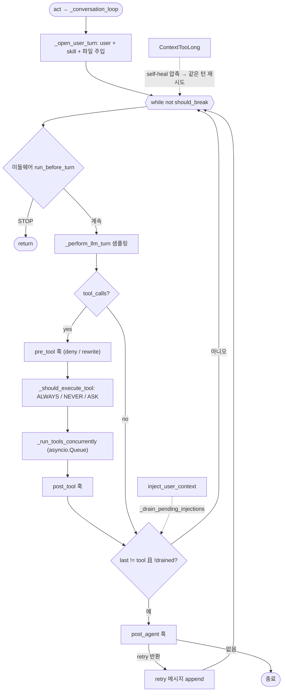

# mistral-vibe (mistralai/mistral-vibe) 턴루프 정밀 분석

Python(asyncio). 전 계층이 `AsyncGenerator[BaseEvent]`로 흐르고, 게이트가 **미들웨어 → 권한 → pre/post_tool 훅 → post_agent 훅** 4층으로 분리된 교과서적 구조.

> "Mistral Code" 제품은 Continue 기반 비공개 엔터프라이즈 IDE 어시스턴트다. 이 문서는 Mistral 공식 공개 CLI 에이전트인 mistral-vibe를 분석한다.

## 0. 소스 맵 (file:line)

| 역할 | 위치 |
|---|---|
| 턴 진입 | `vibe/core/agent_loop/_loop.py` — `act`(898) → `_conversation_loop`(1307) |
| 턴 오픈 | `_open_user_turn`(1268) |
| LLM 턴 | `_perform_llm_turn`(1530), `_stream_assistant_events`(1577), `_chat_streaming`(2143) |
| 도구 처리 | `_handle_tool_calls`(1614), `_run_tools_concurrently`(1651), `_execute_tool_call`(1717) |
| 권한 게이트 | `_should_execute_tool`(1902), `_ask_approval`(1947) |
| 훅 | `vibe/core/hooks/models.py` — `HookType`(20: POST_AGENT/PRE_TOOL/POST_TOOL) |
| 미들웨어 | `vibe/core/middleware.py` — `run_before_turn` |
| /loop 스케줄러 | `vibe/core/loop.py` — `LoopManager`(151) |
| 서브에이전트 | `vibe/core/tools/builtins/task.py` |

---

## 1~2. 진입과 루프

`act(msg)`(898)가 이미지 지원 검사·`checkpoint_recorder.create_checkpoint()` 후 `agent_span` 안에서 `_conversation_loop`를 돌리고, `finally`에서 `seal_turn()`으로 턴의 post-edit 경계를 봉인(턴 단위 편집 귀속·되감기 기반).

`_conversation_loop`(1307)는 `_open_user_turn`(user 메시지 append + /skill·@파일 주입 + 훅 재시도 카운터 리셋)으로 시작한 뒤 `while not should_break`(1329):
```
should_break=False; first_llm_turn=True
while not should_break:
   # ── 게이트 1: 미들웨어 ──
   result = middleware_pipeline.run_before_turn(context)
   _handle_middleware_result(result)
   if result.action == STOP: return

   self._is_user_prompt_call = first_llm_turn
   try:
     async for event in _perform_llm_turn():         ← 샘플링 + 도구 실행
        user_cancelled |= is_user_cancellation_event(event); yield event
   except ContextTooLongError:                        ← 게이트 3: 컨텍스트 자가치유
     if not _should_self_heal(): raise
     _run_compaction(); continue                       ← 턴 예산 미소모 재시도
   stats.steps += 1; first_llm_turn=False
   _save_messages()                                    ← 턴마다 디스크 flush

   if _pending_clear_context: _clear_context_after_plan_accept(); continue

   last_message = messages[-1]
   drained = _drain_pending_injections()               ← 스티어링 흡수
   should_break = (last_message.role != tool) and not drained
   if user_cancelled: return
   if should_break:                                     ← 게이트 4: post_agent 훅
     retry_msg, hook_events = _dispatch_post_turn_hooks()
     yield hook_events
     should_break = _queue_post_turn_retry(retry_msg)   ← retry 있으면 messages.append 후 False (자가 턴)
finally: _save_messages()
```

즉 루프 지속 조건은 **"마지막 메시지가 tool 응답이거나(→도구 결과를 모델에 되돌려야 함) pending injection이 있음"**. `_queue_post_turn_retry`(1386)는 retry_msg가 있으면 append 후 False(계속), 없으면 True(종료).

---

## 3~4. LLM 턴 (`_perform_llm_turn` 1530)

```
if streaming: async for event in _stream_assistant_events(): yield event   ← _chat_streaming 청크
else: yield _get_assistant_event()                                          ← _chat 일괄
last = messages[-1]
parsed = format_handler.parse_message(last)
resolved = format_handler.resolve_tool_calls(parsed, tool_manager)         ← tool_calls / failed_calls
if no tool_calls and no failed_calls: return                               ← 종료 신호
_handle_tool_calls(resolved)                                                ← 도구 실행
profile 변경 시 AgentProfileChangedEvent
```
스트리밍은 `_stream_assistant_events`(1577)가 청크마다 `_build_tool_call_events`로 신규 tool_call 이벤트 + Reasoning/Assistant 이벤트를 방출.

---

## 5~6. 도구 실행과 게이트

`_handle_tool_calls`(1614): 실패 콜을 먼저 이벤트화(`_emit_failed_tool_events`) 후 `_run_tools_concurrently`(1651)로 **동시 실행**:
```
queue = asyncio.Queue()
tasks = [create_task(_execute_tool_to_queue(tc, queue)) for tc in tool_calls]
monitor = create_task(gather(*tasks) → finally queue.put(None))    ← 완료 센티넬
while True: event = queue.get(); if None: break; yield event
(GeneratorExit/CancelledError 시 모든 task cancel)
```

`_execute_tool_call`(1717) 파이프라인(도구당):
1. 도구 조회·입력 직렬화(실패 시 tool error 이벤트).
2. **`_run_pre_tool_pipeline`**(1744) — **pre_tool 훅**: `denial_event`면 도구 에러로 반환(deny), 아니면 `tool_call`/`tool_input`을 **rewrite** 가능.
3. **`_should_execute_tool`**(1902) — **권한 게이트**: `ToolPermission` 3값.
   - `ALWAYS`→즉시 실행. `NEVER`→SKIP+사유. 그 외→required_permissions 중 `_permission_store.covers`로 미커버분만 `_ask_approval`(1947).
   - `_ask_approval`: `approval_callback(tool_name, args, call_id, required_permissions)` → YES면 EXECUTE, 아니면 SKIP+feedback. `approve_always`로 세션 영구 승인. `bypass_tool_permissions`면 전체 우회.
4. SKIP이면 `_handle_tool_skip`, 아니면 `_invoke_tool`(post_tool 훅 포함) 실행.

| 게이트 | 기전 |
|---|---|
| 미들웨어 | `run_before_turn` 매 샘플링 전. `MiddlewareAction.STOP`으로 턴 중단(플랜 모드 전환·안전검사 위치) |
| 권한 | `ToolPermission` ALWAYS/NEVER/ASK + permission_store `covers`. ASK→`approval_callback` |
| 훅 | 3종(`models.py:20`): `PRE_TOOL`(allow/deny/rewrite), `POST_TOOL`(출력 누적 가공), `POST_AGENT`(턴 종료 직전 retry 메시지로 연장=Stop 훅 상당). match 패턴, timeout 60s |
| 컨텍스트 | `ContextTooLongError`→`_should_self_heal`이면 `_run_compaction` 후 같은 턴 재시도(예산 미소모, `first_llm_turn` 유지). 수동 `/compact` 존재 |
| 체크포인트 | 턴 시작 create / 종료 seal — 편집 귀속·rewind 기반 |

---

## 7~8. 종료 / 자가 턴

종료 = `_perform_llm_turn`이 tool_calls 없이 끝나 `last_message.role != tool`이고 pending injection 없음. 자가 턴 발생:
1. **post_agent 훅 retry**(1377) — 훅이 조건 미달을 판정해 retry 메시지를 반환하면 루프 연장(`reset_retry_count`/카운터로 상한).
2. **`/loop` 스케줄러**(`core/loop.py`) — 세션당 최대 50개(`MAX_LOOPS_PER_SESSION`), 최소 30초 간격(`MIN_INTERVAL_SECONDS`)의 주기 프롬프트 등록. `LoopManager.pop_due`(169)를 셸이 폴링해 만기 루프의 프롬프트로 **새 `act()` 턴**을 발생. 이는 턴루프 바깥의 세션 루프 계층.

---

## 9. 스티어링 (pending injection)

`inject_user_context`(860)로 턴 실행 중 컨텍스트를 pending 큐에 넣으면, 각 LLM 턴 종료 후 `_drain_pending_injections`(1371)가 흡수 — 주입이 있으면 마지막 메시지가 assistant여도 `should_break=False`로 **한 바퀴 더** 돈다. Review 턴 등 steer 불가 턴은 active-task 검사로 거부(`session/inject.py`).

---

## 10. 서브에이전트 대기

`task` 빌트인(`tools/builtins/task.py`)이 별도 `AgentLoop` 인스턴스(자체 agent_profile)를 만들어 실행하고 완료를 await. 부모 입장에선 여느 도구 호출과 동일한 대기 구조라 전용 채널이 없다(opencode의 인라인 await와 유사, codex의 wait_agent/openclaude 메일박스와 대조). `fork()`(2299)로 세션 분기도 지원.

---

## 11~12. 이벤트 / 동시성

`BaseEvent` 스트림: `UserMessageEvent, AssistantEvent, ReasoningEvent, ToolCallEvent, ToolResultEvent, ToolStreamEvent, HookEvent, SessionTitleUpdatedEvent, AgentProfileChangedEvent, TeleportEvent…`. 도구 동시 실행은 asyncio.Queue + monitor task 패턴. 취소는 `is_user_cancellation_event` 검사 + `GeneratorExit`/`CancelledError` 시 하위 task cancel + gather. 컨텍스트 초과는 예외로 표출돼 self-heal 루프로 흡수.

---

## 요약

- 게이트 4층(미들웨어→권한→pre/post_tool→post_agent)이 명확히 분리된 교과서적 구조.
- 컨텍스트 초과를 "에러→압축→**같은 턴** 재시도(예산 미소모)"로 처리하는 디테일이 주석까지 명시.
- 훅은 3종으로 미니멀하지만 pre_tool rewrite/deny, post_tool 출력 가공, post_agent retry로 표현력 확보. 자가 턴은 post_agent retry + 세션 밖 `/loop` 스케줄러 2경로.

---

## 루프 구조 다이어그램


