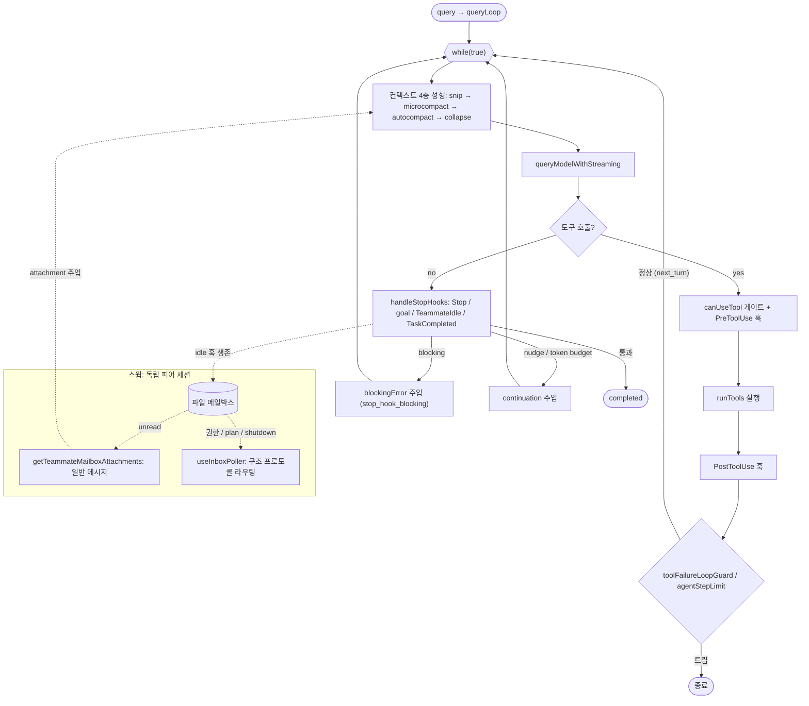

# openclaude (Gitlawb/openclaude) 턴루프 정밀 분석

Claude Code 코드베이스에서 파생되어 멀티 프로바이더로 개조된 오픈소스 CLI (TypeScript, Bun 번들). Claude Code 특유의 **스웜(swarm) 메일박스**와 **훅 기반 자가 지속** 구조를 그대로 승계한다.

## 0. 소스 맵 (file:line)

| 역할 | 위치 |
|---|---|
| 턴루프 본체 | `src/query.ts` — `query`(482), `queryLoop`(504), `while(true)`(605) |
| 전이 타입 정의 | `src/query/transitions.ts` — `Terminal`, `Continue` |
| Stop/Teammate/Task 훅 처리 | `src/query/stopHooks.ts` — `handleStopHooks`(90) |
| goal 지속 판정 | `src/services/goal/controller.ts` — `evaluateGoalAfterTurn`(128) |
| 폭주 가드 | `src/query/toolFailureLoopGuard.ts`, `agentStepLimit.ts`, `tokenBudget.ts` |
| 도구 실행 | `src/services/tools/toolOrchestration.ts` `runTools`(19), `toolExecution.ts` `runToolUse`(407) |
| pre/post 훅 | `src/services/tools/toolHooks.ts` `runPreToolUseHooks`(602)/`runPostToolUseHooks`(52) |
| 커맨드 큐(스티어링) | `src/utils/messageQueueManager.ts` |
| **스웜 메일박스** | `src/utils/teammateMailbox.ts` (파일 기반 인박스) |
| **인박스 폴러** | `src/hooks/useInboxPoller.ts` `useInboxPoller`(130) |
| 메일박스→턴 주입 | `src/utils/attachments.ts` `getTeammateMailboxAttachments`(3871), 주입 지점(966) |
| 부모-자식 서브에이전트 | `src/tools/AgentTool/runAgent.ts` `runAgent`(246) |

---

## 1~2. 진입점과 루프 구성물

`query(params)` (`query.ts:482`)가 `queryLoop`을 `yield*`로 감싸고, 정상 종료 시에만 소비한 커맨드 uuid들에 `notifyCommandLifecycle(uuid,'completed')`를 보낸다(throw/`.return()` 경로에서는 스킵되어 "시작했으나 미완료" 신호가 남음 — 재처리 근거).

`queryLoop`은 **단일 `while(true)`**(605)에 반복 간 이월 상태를 `State` 구조체(455~480)로 명시한다. 핵심 필드: `messages, toolUseContext, autoCompactTracking, stopHookActive, turnCount, continuationNudgeCount, transition(직전 continue 사유), agentStepLimit`, 그리고 폭주 1회성 가드 `hasAttemptedReactiveCompact / hasAttemptedContextOverflowRecovery / hasAttemptedProviderFallback`. 루프 바깥에는 `taskBudgetRemaining`, `pinnedTurnRoute`(턴당 1회 고정되는 스마트 라우팅), `toolFailureGuardState`가 산다.

**모든 continue/return이 타입화**되어 있어 루프가 사실상 사양서다:
- `Terminal` = `completed | blocking_limit | image_error | model_error | aborted_streaming | prompt_too_long | stop_hook_prevented | aborted_tools | hook_stopped | max_turns | agent_step_limit | tool_failure_loop`
- `Continue` = `next_turn | collapse_drain_retry | reactive_compact_retry | context_overflow_compact_retry | provider_max_tokens_retry | provider_fallback_retry | max_output_tokens_escalate | max_output_tokens_recovery | stop_hook_blocking | token_budget_continuation | continuation_nudge`

---

## 3. 반복당 컨텍스트 성형 파이프라인 (query.ts 673~830)

한 반복은 샘플링 전에 다음을 **순서대로** 수행한다(각기 feature 게이트):

1. `getMessagesAfterCompactBoundary` — 압축 경계 이후만 취함, `pendingToolFailureAdvisories` 병합.
2. `applyToolResultBudget`(708) — 도구 결과 총량 예산 초과분을 tool_use_id 단위로 치환(캐시 안전, microcompact와 직교).
3. `snip`(738, `HISTORY_SNIP`) — 오래된 구간 절제, freed 토큰 수를 autocompact 임계에 전달.
4. `microcompact`(754) — tool_use 단위 캐시 편집형 압축.
5. `contextCollapse.applyCollapsesIfNeeded`(782) — **메시지를 지우지 않고 읽기 시점에 접는** 투영. 커밋 로그를 매 진입 시 재생하므로 턴을 넘어 유지.
6. `getArcSummary`(802, `CONVERSATION_ARC`) — 대화 아크 요약을 시스템 프롬프트에 별도 요소로 추가.
7. `autoCompactIfNeeded` — 임계/강제(`canForceCompact`, 메시지 수 초과) 시 전체 요약 압축.

이 다층 압축이 조사 대상 중 가장 복잡하다.

---

## 4. 샘플링 스텝

`queryModelWithStreaming`(`services/api/claude.ts:785`)으로 스트리밍. 반복 상단에서 `yield {type:'stream_request_start'}`. 응답에서 `toolUseBlocks`를 추출해 도구 유무로 두 갈래로 나뉜다. 스트리밍 에러 분기(로프 상단)는 컨텍스트 초과→`reactive_compact_retry`/`context_overflow_compact_retry`(각 1회 가드), 프로바이더 토큰 cap→`provider_max_tokens_retry`, 레이트리밋→`provider_fallback_retry`(1회), 그 외→`model_error` 종료.

---

## 5. 도구 실행 (query.ts 2378~2598, 루프 내부)

도구가 있으면:

1. **agentStepLimit 배분**(2390): 남은 스텝만큼만 `toolUseBlocksToExecute`, 초과분 `blockedToolUseBlocks`. 소진 시 `summaryRequested`.
2. `runTools(toolUseBlocksToExecute, assistantMessages, canUseTool, toolUseContext)`(2432) 또는 스트리밍 실행기. 각 도구는 `runToolUse`(`toolExecution.ts:407`)로 흐른다: 도구 조회(별칭 폴백) → abort 검사 → **`canUseTool` 권한 게이트** → **PreToolUse 훅** → 실행 → **PostToolUse 훅** → tool_result 메시지 yield.
3. `hook_stopped_continuation` attachment가 나오면 `shouldPreventContinuation=true`(2447).
4. 차단된 스텝은 `createAgentStepLimitToolResult`로 합성 결과 주입(2465), 요약 강제 시 `agent_step_limit` 종료(2484).
5. abort 검사(2528) → `aborted_tools`. 훅 중단 → `hook_stopped`(2567).
6. **`updateToolFailureLoopGuard`**(2570): 연속 실패(시그니처/경로/카테고리 단위) 임계 도달 시 API 에러 메시지 yield 후 `tool_failure_loop` 종료.
7. 정상: `turnCount++`, `maxTurns` 초과면 `max_turns`, 아니면 `transition:next_turn`으로 `state`를 재구성(도구 결과를 messages에 병합)하고 `continue`.

---

## 6. 게이트 상세

| 게이트 | 실제 기전 |
|---|---|
| **도구 권한** | `canUseTool` 콜백(호출자 주입). 거부 시 `executePermissionDeniedHooks`. 스웜에서는 워커의 권한 요청이 **메일박스 프로토콜 메시지**로 리더에게 전달됨(§10) |
| **훅** | `runPreToolUseHooks`/`runPostToolUseHooks`/`runPostToolUseFailureHooks` + Stop/StopFailure/TaskCompleted/TeammateIdle. Stop 계열은 제너레이터라 진행 이벤트(`HookProgress`)를 스트림으로 흘리며, blocking 시 결과를 user 메시지로 주입 |
| **goal** | `handleStopHooks` 내부(`stopHooks.ts:528~558`)에서 `activeGoal.status==='active'` && 메인스레드 && 아직 평가 안 된 assistant면 `evaluateGoalAfterTurn` 실행 → 미달 시 blockingError로 `stop_hook_blocking` 재진입 |
| **상한** | `maxTurns`(turnCount 감쇠), `agentStepLimit`(스텝 소진 시 도구 차단+요약 강제), `MAX_CONTINUATION_NUDGES`, `toolFailureLoopGuard` |
| **컨텍스트** | §3의 4층 + reactive/overflow 복구(각 1회 가드). **주석 명시**: compact 실패 후 stop-hook blocking으로 재진입 시 `hasAttemptedReactiveCompact`를 보존해 "compact→실패→훅→compact→…" 무한 루프 차단(`query.ts:2229~2234`) |

---

## 7. 종료 조건

도구가 없을 때만 종료 판정에 진입(2190~2375):
1. 마지막 메시지가 API 에러 → StopFailure 훅만 발화 후 `completed`.
2. `handleStopHooks` → `preventContinuation`이면 `stop_hook_prevented`, `blockingErrors` 있으면 `stop_hook_blocking` continue.
3. 토큰 예산 continuation, continuation nudge(§8) 판정.
4. `agentStepLimit.summaryRequested`면 `agent_step_limit`.
5. 아무것도 아니면 `completed`.

---

## 8. 자가 턴 발생 (3중, 각 cap)

1. **Stop 훅 / goal** — `handleStopHooks`가 blockingError를 반환하면 그 텍스트를 `isMeta` user 메시지로 주입하고 `transition:stop_hook_blocking`으로 continue. `stopHookActive`를 다음 반복에 전달해 훅이 재진입을 스스로 판단. goal은 이 경로에 통합됨.
2. **토큰 예산 continuation**(2253) — `TOKEN_BUDGET` feature. `checkTokenBudget`가 `continue`면 nudge 메시지 주입, `token_budget_continuation`. diminishing returns 시 조기 종료 이벤트.
3. **continuation nudge**(2313) — 모델이 "계속하겠다"류 발화(`analyzeContinuationIntent`)를 했는데 도구를 안 부른 경우, `MAX_CONTINUATION_NUDGES` 미만이면 "Continue with the task…" 주입 후 `continuation_nudge`.

---

## 9. 스티어링 / 커맨드 큐

`messageQueueManager.ts`의 **모듈 수준 우선순위 큐**: `now > next > later`, 동순위 FIFO. `enqueue`/`dequeue`(우선순위별 필터 가능)/`recheckCommandQueue`. REPL·SDK가 턴 사이(between-turn drain)에 dequeue해 다음 턴 입력으로 소비. 태스크 알림도 `enqueuePendingNotification`으로 같은 큐에 들어와 기계 발생 턴을 만든다. `query()`가 소비 uuid를 추적해 정상 종료 때만 completed 통지(§1).

---

## 10. 에이전트 간 통신과 서브에이전트 대기 — 핵심

openclaude에는 **두 종류**의 다중 에이전트가 있고, 턴루프 반영 방식이 완전히 다르다.

### (A) 스웜 = 독립 피어 세션 + 파일 메일박스 (Claude Code 승계)

teammate는 부모-자식이 아니라 **병렬로 도는 독립 OpenClaude 세션**이다(`attachments.ts:3861` 주석). 통신은 파일 인박스 `~/.claude/teams/{team}/inboxes/{agent}.json`(`teammateMailbox.ts:56`)를 통하며, 동시 쓰기는 `proper-lockfile` 재시도(10회 백오프)로 직렬화(35~41).

**메일박스가 턴루프로 들어오는 두 경로:**

1. **일반 메시지 → attachment 주입.** `getTeammateMailboxAttachments`(3871)가 반복 시작부(`getAttachmentMessages`, 966)에서 호출된다. 두 소스를 읽어 합친다: ① 파일 인박스의 unread 중 **비(非)구조 메시지**(`isStructuredProtocolMessage`로 필터), ② `AppState.inbox`의 pending(폴러가 **턴 도중** 큐잉한 것 — 리더 시점). from+timestamp+text로 dedup, idle 알림은 에이전트별 최신만 유지(3983). `teammate_mailbox` attachment를 먼저 만든 뒤 `markMessagesAsReadByPredicate`로 비구조 메시지만 read 처리. → **모델은 다음 샘플링에서 동료 메시지를 컨텍스트로 본다.** 즉 대기는 "블로킹 await"가 아니라 **폴 + attachment 주입**이며, `AppState.inbox` 경로 덕에 턴이 끝나기 전에도(mid-turn) 전달된다.

2. **구조 프로토콜 메시지 → 폴러가 별도 라우팅.** `useInboxPoller`(130, React 훅, 주기 폴)가 unread를 타입별로 분류(236~)해 전용 큐/핸들러로 보낸다: `permission_request/response`, `sandbox_permission_*`, `shutdown_request/approved`, `team_permission_update`, `mode_set_request`, `plan_approval_request/response`. 이들은 attachment 경로가 **일부러 건드리지 않아**(unread 유지) 폴러가 UI/제어 평면에서 처리한다 — LLM 컨텍스트로 새는 것을 방지(3924 주석). 예: 워커의 **도구 권한 요청**이 리더의 `workerPermissions` 큐로 가고, 리더가 승인하면 `permission_response`가 워커 인박스로 회신됨(`processMailboxPermissionResponse`). 플랜 승인은 `useInboxPoller`(162~)에서 team-lead 발신만 수용해 권한 모드를 전환(위조 방지).

**"대기"의 실체 = 두 계층:**
- **워커가 idle로 죽지 않게 유지**: 워커가 할 일을 마치면 루프는 `completed`로 끝나려 한다. 그러나 `handleStopHooks` 안에서 teammate면(`stopHooks.ts:393`) **TaskCompleted 훅**(진행 중이며 자기 소유인 태스크마다, 405~464)과 **TeammateIdle 훅**(`executeTeammateIdleHooks`, 467~509)이 돈다. 이들이 `blockingError`를 반환하면 `stop_hook_blocking` 재진입 → 워커가 살아서 다음 메일박스 메시지를 기다린다. idle 진입 시 워커는 리더에게 `idle_notification`(`createIdleNotification`, idleReason=available/interrupted/failed, 완료 태스크 상태 포함)을 보낸다.
- **리더가 워커 응답을 받는 방식**: 리더는 자기 턴을 끝내고, 워커들의 회신이 리더 인박스/`AppState.inbox`에 쌓이면(폴러가 turn 도중 큐잉) 리더의 **다음 턴에 attachment로** 배달된다. 리더도 idle 유지가 필요하면 동일한 idle 훅 계층으로 산다.

즉 codex의 `wait_agent`(턴을 status watch 채널에 블로킹) 방식과 정반대다. openclaude는 **느슨하게 결합된 피어들이 파일시스템 메일박스로 조율**하고, 턴루프는 (a) 메시지를 attachment로 흡수, (b) idle 훅으로 생존, (c) 구조 프로토콜은 폴러 사이드채널로 처리한다.

### (B) 부모-자식 서브에이전트 = AgentTool

`runAgent`(`tools/AgentTool/runAgent.ts:246`)는 도구 실행 경로에서 **같은 `query` 루프를 자식으로 위임**(`querySource:'agent:…'`, `queryTracking.depth+1`)한다. 부모는 여느 도구처럼 자식 완료를 await(제너레이터 소비). 자식은 자체 `agentStepLimit`을 갖고, 서브에이전트는 툴 사용 요약(Haiku 호출)을 스킵한다(2626).

---

## 11. 방출 이벤트

`StreamEvent | RequestStartEvent | Message | TombstoneMessage | ToolUseSummaryMessage` 스트림. `progress`(훅 진행), `attachment`(hook_stopped_continuation, teammate_mailbox, max_turns_reached, hook_success/error …), `system`(경고/중단), `assistant`/`user` 메시지. UI·SDK·print 모드가 모두 이 스트림을 소비.

---

## 12. 동시성 / 취소

`toolUseContext.abortController.signal`이 전 계층에 전파. 스트리밍 중·도구 중·훅 중 각각 abort를 검사해 `aborted_streaming`/`aborted_tools`/조기 return. 취소 시 `getQueryAbortSystemMessage`·`createUserInterruptionMessage`로 사용자 가시 메시지 생성. 메일박스는 파일 락으로 프로세스 간 직렬화.

---

## 요약

- 단일 `while(true)`지만 전이 완전 열거(Terminal/Continue) + 1회성 가드 플래그로 폭주 시나리오가 사양화됨.
- **Claude Code의 스웜 모델을 승계**: teammate는 독립 세션, 파일 메일박스로 통신. 에이전트 간 "대기"는 블로킹 await가 아니라 **폴+attachment 주입 + idle 훅 생존 + 구조 프로토콜 폴러 라우팅**의 3층. 부모-자식 서브에이전트(AgentTool)는 별개로 도구-await.
- 자가 턴 3중(Stop/goal, token budget, nudge) + 4층 압축이 codex와 함께 가장 정교한 축.

---

## 루프 구조 다이어그램

