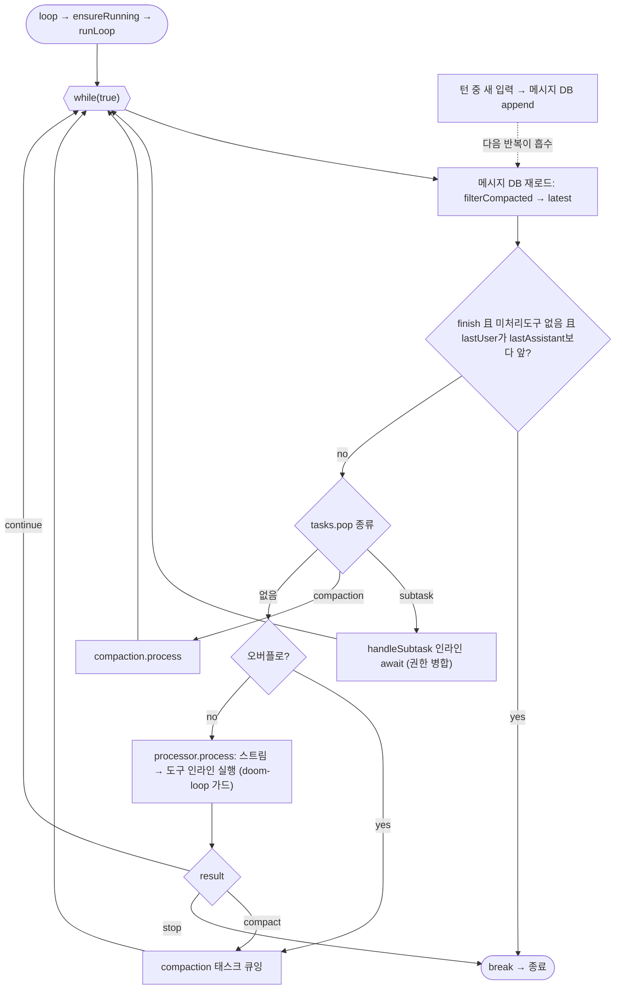

# opencode (sst/opencode) 턴루프 정밀 분석

TypeScript + **Effect**(함수형 이펙트 시스템). 턴루프가 메모리 상태가 아니라 **영속 메시지 로그를 매 반복 재해석**해 다음 행동을 유도하는 선언적 구조가 핵심.

## 0. 소스 맵 (file:line)

| 역할 | 위치 |
|---|---|
| 턴루프 본체 | `packages/opencode/src/session/prompt.ts` — `runLoop`(1081), `while(true)`(1088), `loop`(1343) |
| 단일 LLM 스텝 처리기 | `packages/opencode/src/session/processor.ts` — `process`(627), `handleEvent`, `Result` = compact \| stop \| continue (30) |
| 세션 Runner(busy/idle/interrupt) | `packages/opencode/src/session/run-state.ts` — `ensureRunning`(88), `cancel`(77), `runner`(52) |
| 서브태스크 인라인 | `packages/opencode/src/session/prompt.ts` — `handleSubtask`(255) |
| 컴팩션 | `packages/opencode/src/session/compaction.ts` |
| 권한 | `packages/opencode/src/permission/*` (`permission.ask`) |
| 스텝 상한 프롬프트 | `@opencode-ai/core/session/runner/max-steps` — `MAX_STEPS_PROMPT` |

---

## 1~2. 메시지 로그 = 상태 기계

루프 진입은 `loop()`(1343) → `state.ensureRunning(sessionID, onInterrupt, runLoop)`(1346). 세션마다 **Runner가 하나**(run-state.ts). `runner`(52)가 `runners` 맵에서 기존 것을 재사용하므로:
- 이미 실행 중이면 새 `runLoop`를 띄우지 않고 **기존 실행에 합류** → 턴 중 새 prompt를 보내면 메시지 DB에 기록만 되고 돌던 루프가 다음 반복에서 새 `lastUser`를 발견해 자연 흡수(§9).
- `onIdle`이 runner를 맵에서 지우고 status=idle. `onBusy`가 status=busy.
- `cancel`(77)은 관련 background job(자식 세션 포함)을 `cancelBackgroundJobs`로 재귀 취소한 뒤 runner를 cancel.

`runLoop`(1081)은 단일 `while(true)`(1088). 반복 간 메모리 상태 구조체가 거의 없고, 매 반복 `MessageV2.filterCompactedEffect(sessionID)`로 **메시지 DB를 다시 로드**해 `{lastUser, lastAssistant, lastFinished, tasks}=MessageV2.latest(msgs)`를 재계산한다. 컴팩션·서브태스크도 메시지의 `tasks` 파트로 큐잉되어 루프가 꺼내 처리한다.

---

## 3~4. 반복 골격

```
runLoop(sessionID):
  step=0
  while(true):
    status.set(busy)
    msgs = filterCompacted(sessionID)              ← DB 재로드
    {lastUser, lastAssistant, lastFinished, tasks} = MessageV2.latest(msgs)

    # ── 종료 게이트 ──
    hasToolCalls = 마지막 assistant에 미처리(비-orphan) tool 파트 존재
    if lastAssistant.finish && finish!="tool-calls" && !hasToolCalls && lastUser.id<lastAssistant.id:
       break        ← orphan interrupted tool은 무시하고 종료

    step++
    task = tasks.pop()                             ← 태스크도 메시지 파트
    if task.type=="subtask":   handleSubtask(...); continue
    if task.type=="compaction": compaction.process(...); "stop"이면 break; continue

    # 오버플로 → compaction 태스크 큐잉
    if lastFinished && !summary && compaction.isOverflow(lastFinished.tokens, model):
       compaction.create(auto=true); continue

    # ── 스텝 상한 ──
    maxSteps = agent.steps ?? Infinity
    isLastStep = step>=maxSteps                    ← 마지막 스텝엔 MAX_STEPS_PROMPT를 assistant 메시지로 주입
    msgs = SessionReminders.apply(msgs)
    assistant 메시지 생성/DB기록
    tools = SessionTools.resolve(agent, permission, ...)   ← 권한 규칙 반영 도구셋
    plugin.trigger("experimental.chat.messages.transform")
    result = handle.process({system, messages+(isLastStep? MAX_STEPS_PROMPT:[]), tools, model, ...})

    if structured 완료: break
    if finish=="content-filter": 에러 승격 후 break
    if result=="stop": break
    if result=="compact": compaction.create(...)   ← 다음 반복 처리
    continue
  compaction.prune(sessionID)  (fork)
  return lastAssistant(sessionID)
```

---

## 5~6. 도구 실행과 게이트 (`processor.ts`)

`processor.process`(627)가 단일 LLM 스텝을 담당. `llm.stream(streamInput)`을 `Stream.tap(handleEvent)`로 소비하며 `takeUntil(needsCompaction)`. 도구는 **스트림 이벤트로 인라인 실행**된다:
- `tool-input-start/delta/end` → `ensureToolCall`.
- `tool-call`(331) → 상태 running으로 갱신 후 실행. **doom-loop 가드**(356): 최근 `DOOM_LOOP_THRESHOLD`개 파트가 동일 도구·동일 input이면 `permission.ask({permission:"doom_loop"})`로 사용자 확인.
- `tool-result`(383) → `failToolCall`/결과 반영.

`process`의 반환(679): `needsCompaction`→`"compact"`, `blocked || error`→`"stop"`, 아니면 `"continue"`. `ctx.shouldBreak`는 `experimental.continue_loop_on_deny`가 아니면 기본 true(권한 거부 시 종료).

| 게이트 | 기전 |
|---|---|
| 도구 권한 | `permission.ask({permission, patterns, ruleset})`. 세션에 붙는 `PermissionV1.Rule[]`(allow/deny/ask). `SessionTools.resolve`가 도구셋 구성 시 반영. ask는 Effect가 사용자 응답까지 대기 |
| doom-loop | 동일 도구·동일 input 임계 반복 시 `doom_loop` 권한 요청 |
| 스텝 상한 | agent.`steps`. 초과 스텝엔 `MAX_STEPS_PROMPT` 주입해 마무리 유도 |
| 컴팩션 | 오버플로→compaction 태스크 큐잉→루프가 태스크로 소비. 수동 `/compact`도 동일 경로 |
| 콘텐츠 필터 | `finish=="content-filter"`를 에러 승격(조용한 idle 방지) |
| retry | `Effect.retry(SessionRetry.policy)`로 프로바이더 재시도(status=retry) |
| busy | `assertNotBusy`→`Session.BusyError` (shell 등) |

**훅/자가턴 부재**: codex/openclaude식 Stop 훅·goal·nudge·next-speaker가 **의도적으로 없다.** 종료는 순수하게 메시지 로그의 finish 상태로 결정. 확장은 plugin(`plugin.trigger`)과 명령 체계로 푼다.

---

## 7~8. 종료 / 자가 턴

종료 술어는 "마지막 assistant가 finish(!="tool-calls")로 끝났고 미처리 tool call 없고 lastUser보다 나중"(1111). 이 **선언적 판정** 덕에 어떤 이유로든(크래시·재시작·스티어링) 루프를 다시 돌리면 이어서 실행된다. 자가 턴 발생 장치는 없음.

---

## 9. 스티어링 / 큐

별도 스티어링 채널이 없다. 턴 중 새 입력은 **메시지 DB에 append**되면, `ensureRunning`으로 합류한 기존 `runLoop`이 다음 반복의 `filterCompacted` 재로드에서 새 `lastUser`를 발견해 자연 흡수한다. 즉 큐가 곧 영속 메시지 로그. 커맨드(`command`, 1356)는 subagent 모드 지정 시 `subtask` 파트로 변환되어 같은 경로로 흐른다.

---

## 10. 서브에이전트 대기 — 인라인 await

`subtask` 파트가 큐잉되면 `handleSubtask`(255)가 자식 assistant/tool 파트를 만들고 **`taskTool.execute(...)`를 인라인 await**한다(324). 자식은 별도 세션 루프를 돌고, 권한 `ask`는 `Permission.merge(taskAgent.permission, session.permission)`로 부모 규칙과 병합(346) — 워커가 부모 권한을 상속. 자식 완료 후 부모 루프는 `continue`로 메시지 로그를 재해석해 재개한다. `onInterrupt`가 `taskAbort.abort()`로 자식을 취소하고 파트를 error로 봉인. 즉 "대기"가 별도 채널이 아니라 **루프 반복의 일부**(codex의 블로킹 wait_agent나 openclaude의 폴+메일박스와 대조).

---

## 11~12. 이벤트 / 동시성

이벤트 버스 `events.publish`(`Session.Event.Error`, `Command.Event.Executed` 등) + `SessionStatus`(busy/idle/retry). 동시성/취소는 Effect가 언어 차원에서 강제: `Effect.onInterrupt`로 중단 시 assistant 메시지 finalize 보장(`finalizeInterruptedAssistant`, prompt.ts:1203), `Effect.ensuring(cleanup())`로 정리, `Scope`로 background fork(title/summary/prune) 관리. Runner의 `onInterrupt`가 세션 취소 시 `lastAssistant`를 반환.

---

## 요약

- 루프의 "재료"가 **영속 메시지 로그**다. compaction·subtask도 메시지 파트로 큐잉되어 루프가 소비 → 스티어링·재시작·크래시 복구가 구조적으로 공짜. 대가는 매 스텝 DB 왕복.
- 자가 턴 장치(Stop훅/goal/nudge/next-speaker)를 **의도적으로 배제**하고 finish 상태 기반 선언적 종료. 확장은 plugin/command로.
- 서브에이전트는 `handleSubtask` 인라인 await(권한 병합 상속). Effect의 interrupt/ensuring/scope가 중단 안전성을 언어 차원에서 보장.

---

## 루프 구조 다이어그램


