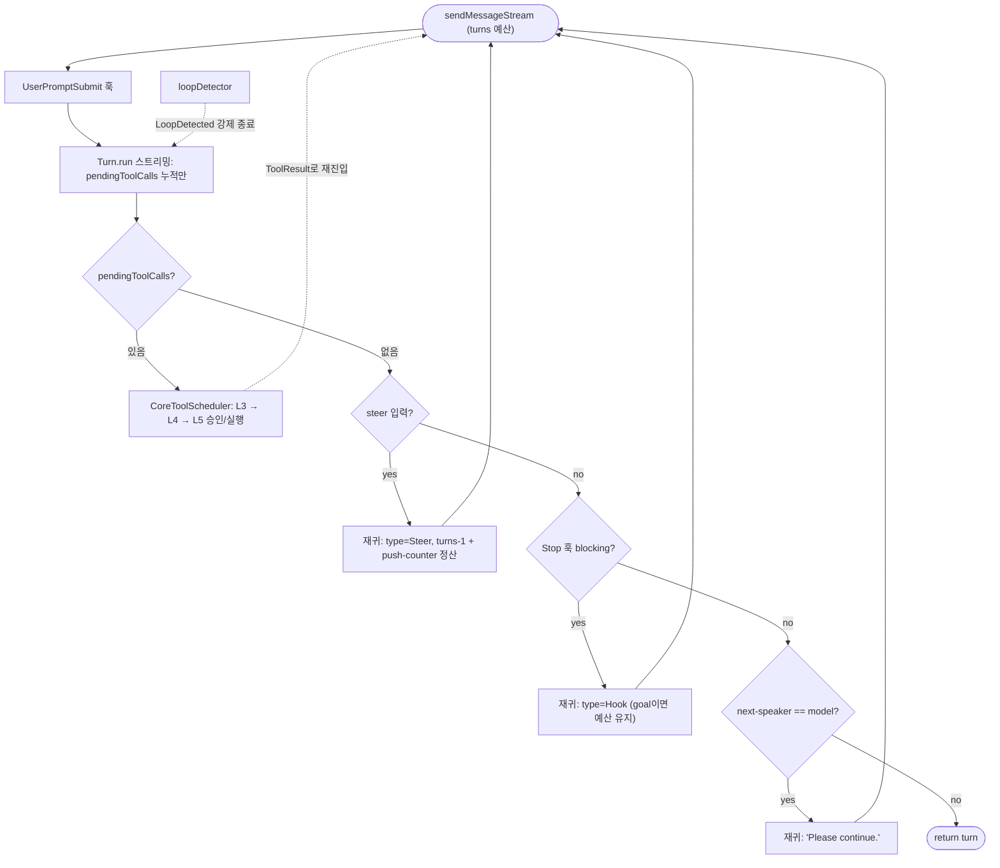

# qwen-code (QwenLM/qwen-code) 턴루프 정밀 분석

gemini-cli 계보의 TypeScript 구현. 턴루프가 **재귀 async generator**(`sendMessageStream`이 자신을 `yield*`)이고, 도구 실행은 루프 **바깥**의 스케줄러가 담당하는 이원 구조가 특징.

## 0. 소스 맵 (file:line)

| 역할 | 위치 |
|---|---|
| 턴루프 본체(재귀) | `packages/core/src/core/client.ts` — `GeminiClient.sendMessageStream`(1832), `MAX_TURNS=100`(141) |
| 단일 스트리밍 응답 | `packages/core/src/core/turn.ts` — `Turn.run`(446), `handlePendingFunctionCall`(634) |
| 도구 스케줄러+승인 | `packages/core/src/core/coreToolScheduler.ts` — L3→L4→L5 흐름(2312~), `awaiting_approval`(433) |
| next-speaker 판정 | `packages/core/src/utils/nextSpeakerChecker.ts` — `checkNextSpeaker` |
| 히스토리+자동압축 | `packages/core/src/core/geminiChat.ts` |
| 훅 전달 버스 | MessageBus (`MessageBusType.HOOK_EXECUTION_REQUEST/RESPONSE`) |

---

## 1~2. 재귀 제너레이터 루프

`sendMessageStream`(1832)은 while이 아니라 **자기 자신을 `yield*`하는 재귀**로 턴을 잇는다. 남은 턴 예산 `turns`(최초 `MAX_TURNS=100`)를 재귀 인자로 감쇠시켜 어떤 continuation 경로든 전체 상한이 보장된다. 각 재귀 단계의 성격은 `SendMessageType`으로 타입화된다: `UserQuery | Retry | Steer | Hook | Cron | Notification | Teammate | ToolResult`.

```
sendMessageStream(request, signal, prompt_id, options, turns=100):
  messageType 판별
  # ── 진입 게이트: UserPromptSubmit 훅 (MessageBus) ──
  if UserQuery류 && hasHooksForEvent('UserPromptSubmit'):
     messageBus.request(UserPromptSubmit) → block이면 UserPromptSubmitBlocked yield 후 return
                                           → additionalContext는 request에 append
  # Notification/Teammate는 chat recording에 기록(기계 재진입)
  if top-level(UserQuery/Cron/Notification/Teammate): loopDetector.reset(prompt_id)

  turn = new Turn(chat, prompt_id)
  for event in turn.run(model, request, signal):     ← 스트리밍 (turn.ts:446)
     loopDetector 검사 → LoopDetected면 endInteractionSpan('error') 후 return
     ChatCompressed 이벤트 → forceFullIdeContext=true, restoreStartupContextAfterCompaction, SessionStart(Compact) 훅 재발화
     yield event
     Error 이벤트 → return

  # ── 턴 종료 판정 (pendingToolCalls 없을 때만) ──
  boundedTurns = min(turns, MAX_TURNS)
  if !turn.pendingToolCalls:
     1. steerInput = takeSteerInput(boundedTurns-1)
        있으면 → yield* sendMessageStream(steer.parts, type=Steer, boundedTurns-1); settleSteerInput
     2. Stop 훅 (MessageBus, hasHooksForEvent('Stop')):
        blocking/stopExecution이면:
           iterationCount++; stopHookBlockingCap 도달 시 abortGoalForStopHookCap + 경고 후 return
           loopDetector.reset  (continuation은 새 논리 턴)
           hookTurnBudget = activeGoal ? boundedTurns : boundedTurns-1     ← goal이면 예산 미감쇠
           yield* sendMessageStream(continueReason[+pending steer], type=Hook, hookTurnBudget)
     3. next-speaker check (skipNextSpeakerCheck 아니면):
        checkNextSpeaker(chat) == 'model'이면
           yield* sendMessageStream(pendingSteer ?? "Please continue.", type=Hook/Steer, boundedTurns-1)
     4. return turn
  # pendingToolCalls 있으면 여기서 그냥 return turn → 스케줄러가 실행 후 ToolResult로 재진입
```

`this.getChat().getUserContentPushCount()` 스냅샷을 활용해 steer 입력이 히스토리에 실제로 push됐는지 검증한다(§9).

---

## 3~4. Turn.run — 스트리밍만, 도구는 누적만 (`turn.ts:446`)

`Turn.run`은 **도구를 실행하지 않는다.** `chat.sendMessageStream`을 소비하며 이벤트를 방출하고, function call은 `handlePendingFunctionCall`(634)로 `this.pendingToolCalls`에 **누적만** 한다:
```
for streamEvent in chat.sendMessageStream(model, req):
  signal.aborted → yield UserCancelled; return
  'retry' → pendingToolCalls/citations/finishReason 초기화, yield Retry, continue
  'model_fallback' → 부분응답 상태 초기화, yield ModelFallback, continue
  'compressed' → yield ChatCompressed, continue
  chunk → yield Thought / Content / (functionCalls마다) ToolCallRequest / Finished(finishReason)
```
`finishReason==MAX_TOKENS`면 pending tool call을 `wasOutputTruncated`로 표시(파라미터 에러와 구분). 에러는 `reportError` 후 `GeminiEventType.Error`로 방출.

도구 실행은 **상위 계층(CLI `useGeminiStream` / ACP daemon)**이 `ToolCallRequest` 이벤트를 받아 `CoreToolScheduler`로 처리하고, 결과를 `SendMessageType.ToolResult`로 `sendMessageStream`에 재주입한다. 이 왕복 전체가 하나의 논리 턴.

---

## 5~6. 도구 스케줄러와 승인 게이트 (`coreToolScheduler.ts`)

스케줄러는 각 도구를 **L3→L4→L5 권한 흐름**(2312~)으로 처리:
- `evaluatePermissionFlow`(2318) → `defaultPermission/finalPermission(allow|deny|ask)/pmForcedAsk/denyMessage/requiresUserInteraction`.
- L5: `ApprovalMode`(DEFAULT/AUTO/PLAN)와 결합. `finalPermission==='allow'`(+auto-review 예외 아님)→`scheduled`(자동승인), `'deny'`→`error`(EXECUTION_DENIED), `'ask'`→**`awaiting_approval`** 상태로 전환해 `handleConfirmationResponse`를 기다림.
- AUTO 모드는 protected-write/shell 분류로 allow를 강제 재검토(`forceAutoReviewForAllow`)하고 denialTracking 스트릭을 관리.
- **PLAN 모드 teammate**: 리더 승인 전이면 사전승인 허용 도구(EXIT_PLAN_MODE/TASK_UPDATE 등)만 통과, 나머지는 차단(2355). 이 승인은 §10의 메일박스와 연결.

| 게이트 | 기전 |
|---|---|
| UserPromptSubmit 훅 | MessageBus 요청. Retry/Steer/Cron/Notification/Teammate엔 미발화(기계 재진입 보호) |
| 도구 승인 | 스케줄러 L3→L4→L5. ask→`awaiting_approval`→confirmation 응답 |
| Stop 훅 + /goal | MessageBus. blocking 시 continuation 재귀. `stopHookBlockingCap`이 연쇄 상한, 도달 시 goal abort |
| next-speaker | `checkNextSpeaker`(LLM에게 다음 화자 질의) == 'model'이면 "Please continue." 자가 지속 |
| loopDetector | 반복 도구/콘텐츠 감지→LoopDetected 강제종료. 논리 턴 경계마다 reset |
| 예산 | MAX_TURNS=100, 모든 재귀에서 감쇠(goal 활성 Stop 훅만 예산 유지+별도 cap) |
| 압축 | `chat.sendMessageStream` 내부 임계 시 자동압축→ChatCompressed→시작 프렐류드 복원+SessionStart(Compact) 훅 |

---

## 7~8. 종료와 자가 턴

종료 = `!pendingToolCalls`에서 steer/Stop훅/next-speaker 모두 continuation을 만들지 않고 `return turn`. 자가 턴 발생 경로가 조사 대상 중 가장 다양:
1. **Stop 훅 / `/goal`** — blocking 시 `continueReason`으로 Hook 타입 재귀. goal 활성 시 예산 미감쇠(무한 방지는 `stopHookBlockingCap`+`MAX_GOAL_ITERATIONS`). 매 continuation마다 `loopDetector.reset`으로 per-turn 도구 예산 리셋.
2. **next-speaker check** — 모델 발화가 "모델이 계속" 판정 시 "Please continue." 재귀.
3. **기계 발생 턴** — `Cron`(스케줄 작업), `Notification`(작업 알림), `Teammate`(팀 통신)가 사용자 개입 없는 top-level 재진입으로 1급 존재.

---

## 9. 스티어링 / 정산 (settlement)

턴 중 입력은 steer 큐에 쌓이고 턴 경계(pendingToolCalls 없을 때)마다 `takeSteerInput(budget)`으로 소비해 Steer 재귀. 특이점은 **push-counter 정산**(`settleSteerInput`, 1848):
```
attachedSteerPushCount = getUserContentPushCount()
... steer 소비 재귀 ...
if getUserContentPushCount() > pushCountBefore: steerInput.accept()   ← 히스토리에 실제 반영됨
else: steerInput.restore()                                            ← 큐로 되돌림
```
히스토리 길이가 아닌 **push 카운터**를 쓰는 이유: 자동압축이 send 도중 히스토리를 줄여도(length 비교는 오판) 카운터는 push 성공에만 증가하므로 압축에 불변(1876 주석). Retry는 `stripOrphanedUserEntriesFromHistory`로 고아 user 엔트리를 떼어냈다가 push 안 됐으면 복원.

---

## 10. 에이전트 간 통신·서브에이전트 대기

- **서브에이전트**: 별도 실행 스코프에서 같은 클라이언트 메커니즘 재사용, `SubagentStart/Stop`류 훅·이벤트로 부모 통지. 부모의 Task류 도구가 자식 완료를 await.
- **팀(Teammate)**: `SendMessageType.Teammate` envelope이 기계 발생 턴으로 유입(Cron/Notification과 동급). PLAN 모드에서 워커의 도구 승인은 리더 승인 전까지 사전승인 도구만 통과(`isPlanRequiredTeammateAwaitingApproval`, coreToolScheduler 2355) — openclaude의 메일박스 권한 프로토콜과 유사한 리더-워커 승인 계층이 스케줄러에 내장.

---

## 11~12. 이벤트 / 동시성

`ServerGeminiStreamEvent`(GeminiEventType): `Content, Thought, ToolCallRequest, ToolCallResponse, ToolCallConfirmation, Retry, ModelFallback, ChatCompressed, LoopDetected, UserPromptSubmitBlocked, HookSystemMessage, StopHookLoop, Citation, Finished, Error, UserCancelled`. UI·ACP·daemon이 공유. 취소는 `AbortSignal`을 Turn.run·스케줄러 전역에 전파, 각 지점에서 `signal.aborted` 검사 후 `UserCancelled`/조기 return. 압축·steer·prefetch는 `normalCompletion` 플래그로 정상 종료 경로에서만 pending prefetch를 보존.

---

## 요약

- **재귀 제너레이터 + 예산 전파**: 루프 한 바퀴 = 재귀 한 단계, 각 continuation이 `SendMessageType`으로 타입화.
- 도구는 Turn 바깥 스케줄러가 L3→L4→L5로 승인/실행하고 ToolResult로 재진입 — 루프와 실행의 명확한 분리.
- 자가 턴 경로 최다(Stop/goal, next-speaker, Cron/Notification/Teammate)에 각각 cap. steer는 push-counter 정산으로 압축과 안전하게 공존.

---

## 루프 구조 다이어그램


