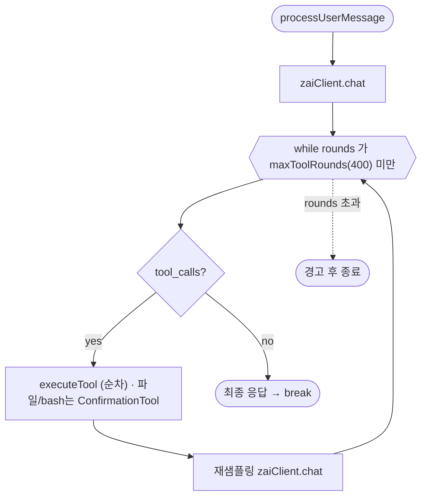

# zai-glm-cli (guizmo-ai/zai-glm-cli) 턴루프 정밀 분석

Ink 기반 TUI(TypeScript). superagent-ai/grok-cli를 포크해 Z.ai GLM 모델을 연결한 커뮤니티 구현체. "도구 유무로 반복하다 최종 응답" 수준의 **고전 루프 원형**으로, 현대 구현과의 격차를 보여주는 대조군.

> Z.ai(Zhipu) 공식 조직(zai-org)에는 공개 CLI 에이전트 레포가 없다. GLM Coding Plan은 Claude Code/Cline 등 기존 도구에 GLM 엔드포인트를 연결하는 구독 상품이라, "glm code"의 공개 구현체로는 이 레포가 가장 근접하다.

## 0. 소스 맵 (file:line)

| 역할 | 위치 |
|---|---|
| 턴루프(비스트리밍) | `src/agent/zai-agent.ts` — `processUserMessage`(≈430), `while(toolRounds<maxToolRounds)`(459) |
| 턴루프(스트리밍) | `processUserMessageStreaming`(≈665), `while`(681) |
| 도구 디스패치 | `executeTool`(935) — switch 문 |
| 스트림 누적 | `src/agent/stream-processor.ts` — `StreamProcessor.process`, tool_calls 인덱싱(175) |
| 확인 게이트 | `ConfirmationTool`(agent 필드 63/95, 도구 구현부 내장) |
| 서브에이전트 | `src/agents/task-orchestrator.ts` — `TaskOrchestrator`(17), `executeParallel`(145) |

---

## 1~2. 루프 구성물

`maxToolRounds`(기본 400)가 유일한 상한. 반복 간 이월 상태는 `this.messages`(대화 히스토리)와 `this.chatHistory`(UI용 ChatEntry)뿐 — 상태 구조체·전이 타입이 없다.

### 비스트리밍 (`processUserMessage:430`)
```
messages.push(user); newEntries=[userEntry]; toolRounds=0
response = zaiClient.chat(messages, tools)
while toolRounds < maxToolRounds:                      (459)
   msg = response.choices[0].message
   if msg.tool_calls:
      toolRounds++
      assistant(tool_calls) 메시지 push
      for toolCall in msg.tool_calls:                  ← 순차
         result = executeTool(toolCall)
         role:"tool" 결과 메시지 push
      response = zaiClient.chat(messages, tools)        ← 재샘플링
   else:
      최종 assistant push; break
if toolRounds >= maxToolRounds: "최대 라운드 도달" 경고
```

### 스트리밍 (`processUserMessageStreaming:665`)
동일 골격 + **상태 머신**(`createChatStateMachine`): `thinking → planning_tools → executing_tools`. `StreamProcessor.process(stream)`가 델타를 누적해 `finishReason==="tool_calls" && toolCalls.length>0`을 판정(stream-processor.ts:139). 각 반복·각 도구 전에 `abortController.signal.aborted` 검사 → 취소 시 `[Operation cancelled]` 후 `done`. 도구는 **순차** 실행(758~).

---

## 3~6. 샘플링·도구·게이트

- **샘플링**: `zaiClient.chat`(일괄) 또는 `chatStream`(스트리밍). 스트리밍은 `StreamProcessor`가 `tool_calls`를 index 기준으로 누적(175~195, 델타 병합).
- **도구 실행**: `executeTool`(935)는 큰 `switch`로 `view_file/create_file/str_replace_editor/edit_file/bash/search/batch_edit/…`를 각 도구 인스턴스에 직접 위임. **루프 레벨 권한 게이트가 없다.**
- **확인 게이트**: 파일 조작(create_file, str_replace_editor)과 bash만 **도구 구현부에 내장된 `ConfirmationTool`**로 실행 전 사용자 확인(시스템 프롬프트 199~200에 명시). "세션 동안 승인" 옵션 존재. 거부 처리는 시스템 프롬프트로 모델에 위임("거부되면 대안을 제시하라", 294). `executeTool` switch 자체엔 확인 로직이 없어, 게이트가 도구 안쪽에 흩어져 있다.

| 게이트 | 유무 |
|---|---|
| 사용자 확인 | 있음(파일/bash, 도구 내장) |
| 라운드 상한 | 있음(`maxToolRounds=400`) — 유일한 폭주 방어 |
| 취소 | 있음(`abortController`, 반복·도구 전 검사) |
| 훅 | **없음**(`src/hooks/`는 React UI 훅뿐) |
| 컴팩션 | **없음**(토큰 카운터로 집계만, 초과는 API 에러) |
| 미들웨어 | **없음** |

---

## 7~10. 종료·자가턴·스티어링·서브에이전트

- **종료**: `msg.tool_calls`가 없으면 최종 응답 push 후 `break`. 루프 종료 = 턴 종료.
- **자가 턴**: **없음.** Stop 훅/goal/next-speaker/nudge/token-budget 류 재진입 장치가 전무.
- **스티어링/메시지 큐**: **없음.** 턴 실행 중 입력은 처리되지 않고, 개입은 프로세스 수준 abort뿐.
- **서브에이전트**: `TaskOrchestrator`(task-orchestrator.ts:17, EventEmitter)가 코드리뷰·테스트·문서화 등 특화 에이전트를 관리. `executeParallel`(145)은 `Promise.all`로 병렬(maxConcurrency 설정 가능, 286), `executeSequential`(164)도 제공. 각 서브에이전트는 독립 히스토리로 실행되고 결과가 부모 히스토리에 합쳐짐 — 부모와의 상호작용은 단순 await(전용 큐/메일박스/status 채널 없음).

---

## 11~12. 이벤트 / 동시성

"이벤트"는 UI 렌더링용 `ChatEntry` 갱신 + 제너레이터 yield(`content/tool_calls/tool_result/done/token_count/thinking`)뿐. 동시성은 `abortController` 하나로 프로세스 수준 취소만. 도구는 순차 실행이라 도구 간 병렬성 없음(서브에이전트만 TaskOrchestrator로 병렬).

---

## 요약 — 진화 스펙트럼의 원점

턴루프 발전 단계의 베이스라인이다: 게이트는 사용자 확인 1종(도구 내장), 이벤트는 UI ChatEntry 갱신뿐이며, 훅·미들웨어·메시지 큐·컴팩션·자가 턴·스티어링이 **모두 없다**. codex/openclaude 급 구현과 비교하면 "루프 사이에 개입 계층(훅·미들웨어·큐·메일박스·압축)을 얼마나 체계적으로 끼워 넣었는가"가 현대 에이전트 복잡도의 본질임을 역으로 드러낸다.

---

## 루프 구조 다이어그램



> 훅·미들웨어·메시지 큐·컴팩션·자가 턴·스티어링이 모두 없는 최소 루프 — 위 다이어그램이 전부다.
