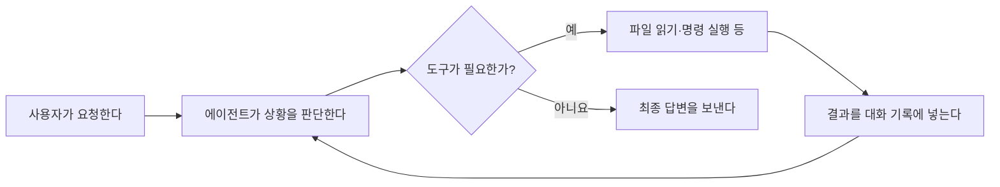
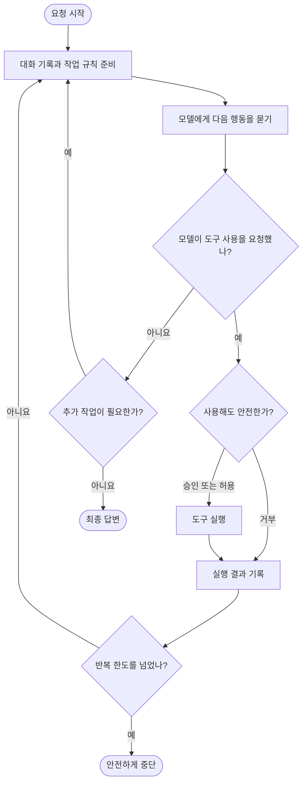

# 코딩 에이전트의 턴은 어떻게 움직일까?

이 문서는 코딩 에이전트가 사용자의 요청을 받은 뒤 최종 답을 내놓기까지 무슨 일을 반복하는지 쉽게 설명한다.

## 먼저 알아둘 한 가지

여기서 **턴(turn)**은 “사용자가 한 번 말하고, 에이전트가 한 번 답하는 구간”이다.

하지만 에이전트는 바로 답하지 않을 수 있다. 필요한 파일을 읽고, 명령을 실행하고, 결과를 확인한 뒤 다시 생각한다. 이 반복이 **턴 루프(turn loop)**다.

쉽게 말하면 다음과 같다.

> 요청을 읽는다 → 필요한 일을 한다 → 결과를 보고 다시 판단한다 → 충분하면 답한다

## 이 문서에서 비교하는 에이전트

| 에이전트 | 가장 쉬운 특징 | 자세히 보기 |
|---|---|---|
| Codex | 세션을 받는 바깥 루프와 실제 작업을 하는 안쪽 루프가 분리되어 있다. | [Codex](codex.md) |
| OpenClaude | 작업 상태와 안전장치를 한곳에서 꼼꼼하게 관리한다. | [OpenClaude](openclaude.md) |
| Qwen Code | “다음 턴을 다시 호출”하는 방식으로 반복을 이어 간다. | [Qwen Code](qwen-code.md) |
| OpenCode | 매번 저장된 대화 기록을 다시 읽고 다음 행동을 정한다. | [OpenCode](opencode.md) |
| Mistral Vibe | 도구 실행 전후의 개입 지점이 단순하고 분명하다. | [Mistral Vibe](mistral-vibe.md) |
| zai-glm-cli | 도구 요청이 있으면 실행하고, 없으면 끝내는 가장 단순한 구조다. | [zai-glm-cli](zai-glm-cli.md) |

조사한 저장소와 정확한 대상은 [reference/README.md](../reference/README.md)에 정리되어 있다.

## 모두에게 공통인 기본 흐름

에이전트마다 차이가 나는 곳은 주로 네 군데다.

1. **기억을 관리하는 법**

   어떤 구현은 메모리 안의 상태를 이어 쓰고, OpenCode는 저장된 메시지를 매번 다시 읽는다.

2. **도구 사용을 허용하는 법**

   파일 수정이나 명령 실행 전에 규칙으로 자동 허용하거나 사용자에게 확인한다.

3. **“아직 끝나지 않았다”를 판단하는 법**

   도구 요청뿐 아니라 목표 검사, 종료 훅, “계속하겠다”는 표현 등을 보고 작업을 더 이어 가기도 한다.

4. **새 입력과 다른 에이전트의 결과를 받는 법**

   큐, 메시지 로그, 메일박스처럼 서로 다른 통로를 사용한다.

## 차이를 한눈에 보기

| 질문 | Codex | OpenClaude | Qwen Code | OpenCode | Mistral Vibe | zai-glm-cli |
|---|---|---|---|---|---|---|
| 다음 반복은 어떻게 시작하나? | 같은 작업 루프로 돌아감 | 상태를 갱신하고 반복 | 자기 함수를 다시 호출 | 저장 메시지를 다시 읽음 | 같은 작업 루프로 돌아감 | 같은 단순 루프로 돌아감 |
| 턴 도중 새 요청을 받을 수 있나? | 입력 큐 | 우선순위 큐 | 임시 입력 보관함 | 메시지 저장소 | 대기 입력 목록 | 지원하지 않음 |
| 스스로 계속할 수 있나? | 종료 훅이 요청할 때 | 목표·종료 훅·계속 신호 | 종료 훅·다음 화자 검사 | 별도 기능 없음 | 종료 훅이 재시도할 때 | 별도 기능 없음 |
| 긴 대화를 줄이나? | 자동 요약 | 여러 단계로 축약 | 채팅 내부에서 압축 | 압축 작업을 메시지로 예약 | 길이 초과 때 압축 후 재시도 | 지원하지 않음 |
| 자식 에이전트를 기다리는 법 | 상태 채널로 대기 | 도구형 자식은 직접 대기, 팀원은 메일박스 | Task 도구 완료 대기 | 작업 안에서 직접 대기 | 작업 안에서 직접 대기 | 여러 작업을 함께 대기 가능 |

## 문서 읽는 순서

처음이라면 다음 순서를 권한다.

1. 가장 단순한 [zai-glm-cli](zai-glm-cli.md)에서 기본 반복을 본다.
2. [Mistral Vibe](mistral-vibe.md)에서 승인과 훅이 어떻게 추가되는지 본다.
3. [OpenCode](opencode.md)에서 메시지 기록 중심 설계를 본다.
4. [Codex](codex.md), [OpenClaude](openclaude.md), [Qwen Code](qwen-code.md)에서 고급 제어 흐름을 비교한다.

## 용어 미니 사전

| 용어 | 쉬운 뜻 |
|---|---|
| 샘플링 | 모델에게 다음 답이나 행동을 만들어 달라고 요청하는 것 |
| 도구 호출 | 모델이 파일 읽기, 검색, 명령 실행 등을 요청하는 것 |
| 훅(hook) | 특정 시점에 추가 검사나 동작을 끼워 넣는 장치 |
| 게이트(gate) | 위험한 동작을 실행하기 전에 허용 여부를 판단하는 문 |
| 스티어링(steering) | 턴이 끝나기 전에 들어온 새 사용자 지시 |
| 컴팩션(compaction) | 긴 대화 기록을 요약해 짧게 만드는 것 |
| 서브에이전트 | 일부 작업을 나누어 맡는 별도 에이전트 |

각 개별 문서의 마지막 **기술 참고**에는 구현을 다시 확인할 수 있도록 주요 파일과 함수 이름을 남겼다.
