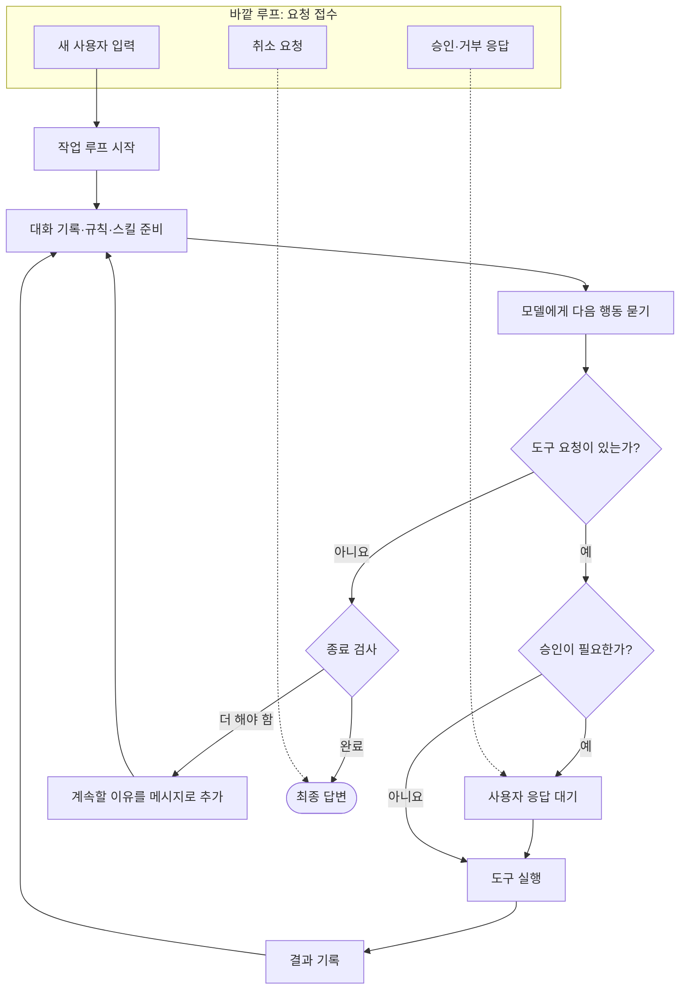
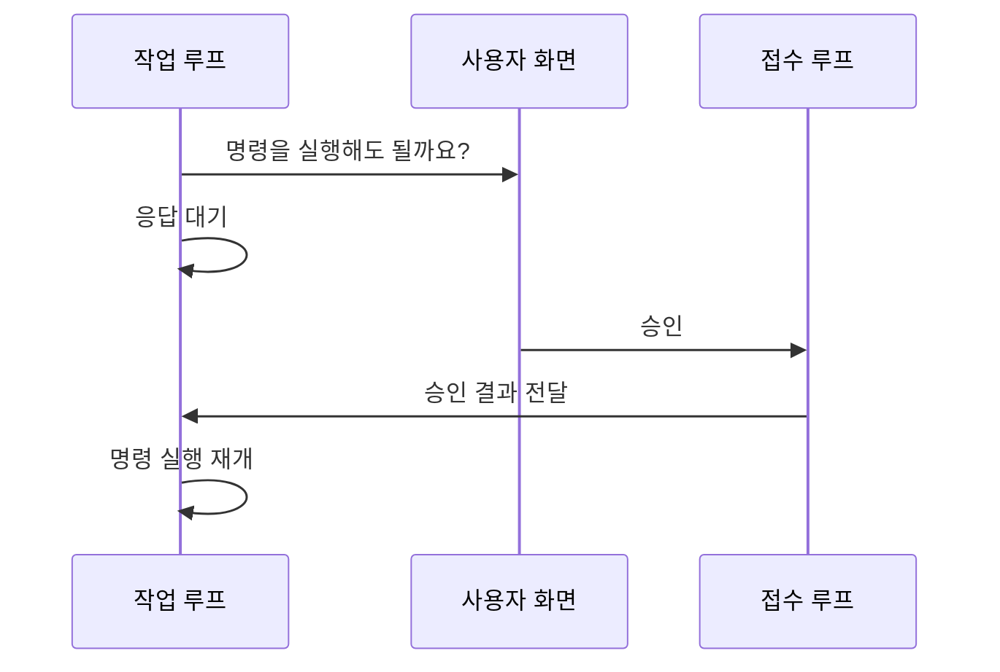
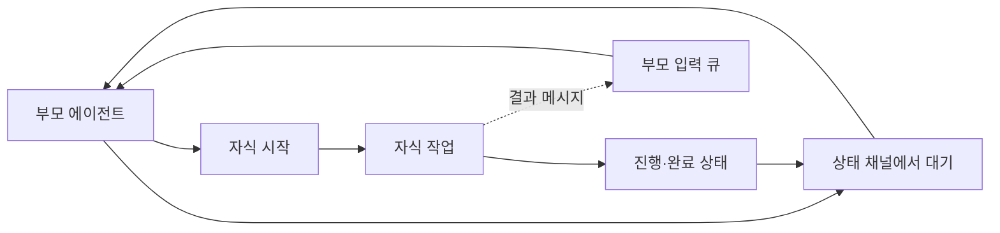

# Codex: 접수와 작업이 분리된 턴 루프

## 한 줄 요약

바깥쪽은 새 요청과 승인 응답을 계속 받고, 안쪽은 한 요청을 해결할 때까지 모델 호출과 도구 실행을 반복한다.

## 비유로 이해하기

식당으로 보면 이해하기 쉽다.

- **카운터**는 새 주문, 주문 변경, 결제 승인을 계속 받는다.
- **주방**은 주문 하나를 완성할 때까지 조리와 확인을 반복한다.
- 주방이 위험한 작업의 승인을 기다리는 동안에도 카운터는 답을 받을 수 있다.

이 분리 덕분에 긴 명령이 실행 중이어도 사용자가 취소하거나, 승인하거나, 지시를 덧붙일 수 있다.

## 전체 흐름

## 두 개의 루프

### 1. 바깥 루프: 접수 담당

세션이 살아 있는 동안 계속 실행된다. 다음과 같은 신호를 받는다.

- 새 사용자 요청
- 명령 실행 또는 파일 수정 승인
- 질문에 대한 사용자 답변
- 작업 취소
- 다른 에이전트가 보낸 메시지

새 요청이 들어왔을 때 작업이 없다면 새 턴을 시작한다. 이미 일반 작업이 진행 중이면 새 입력을 현재 턴에 추가할 수 있다.

### 2. 안쪽 루프: 실제 작업 담당

한 요청을 처리한다.

1. 필요한 경우 긴 대화를 요약한다.
2. 스킬, 플러그인, 현재 시간 같은 보조 정보를 준비한다.
3. 턴 시작 훅과 사용자 입력 훅을 실행한다.
4. 모델을 호출한다.
5. 도구 요청이 있으면 실행 결과를 기록하고 반복한다.
6. 도구 요청이 없으면 종료 훅을 확인한다.
7. 종료 훅이 “아직 끝나지 않았다”고 판단하면 이유를 추가하고 반복한다.

## 도구 승인은 어떻게 기다릴까?

작업 루프는 승인 요청마다 일회용 응답 통로를 만든다. 바깥 루프가 사용자의 승인 또는 거부를 받으면 같은 통로로 답을 보내고, 기다리던 도구가 실행을 재개한다.

응답 통로가 사라지거나 세션이 닫히면 안전하게 거부된 것으로 처리한다.

## 턴 도중 새 지시

Codex는 두 종류의 입력을 한 큐에서 구분한다.

- **사용자 스티어링**: “그 파일 말고 다른 파일을 봐”처럼 진행 중에 들어온 새 지시
- **에이전트 메일**: 자식 또는 동료 에이전트가 보낸 결과

이 입력들은 아무 때나 모델 대화에 끼어들지 않는다. 현재 모델 호출이 끝나는 안전한 경계에서 꺼내 다음 모델 호출에 포함한다. 대화 압축 직후처럼 순서를 지켜야 하는 시점에는 잠시 미룬다.

## 왜 모델이 답했는데도 계속할까?

모델이 도구 없이 답했다고 항상 끝나는 것은 아니다. 종료 훅이 목표 달성 여부를 검사할 수 있다.

- 통과하면 턴을 끝낸다.
- 실패 이유와 계속할 내용을 주면 그 내용을 새 메시지로 기록하고 다시 모델을 호출한다.
- 같은 종료 훅이 끝없이 자신을 호출하지 않도록 재진입 상태를 함께 관리한다.

## 긴 대화 처리

모델을 부르기 전이나, 작업 도중 토큰이 부족해질 때 대화를 요약한다. 요약 뒤에도 도구 결과와 새 입력의 순서가 깨지지 않도록 입력 큐를 잠시 멈췄다가 안전한 시점에 다시 연다.

## 서브에이전트

Codex는 자식 에이전트를 시작한 뒤 `wait_agent`로 상태 변화를 기다릴 수 있다. 기다림에는 마감 시간이 있으며, 완료된 자식이 생기면 결과를 모아 반환한다. 자식이 보내는 별도 메시지는 부모의 입력 큐로 들어온다.

## 이 구현에서 배울 점

- 요청 접수와 실제 작업을 분리하면 승인, 취소, 중간 지시를 자연스럽게 처리할 수 있다.
- 새 입력은 즉시 끼워 넣기보다 안전한 경계에서 반영해야 대화 순서가 보존된다.
- 자동 계속 기능에는 반드시 재진입 방지와 종료 조건이 필요하다.

## 기술 참고

| 역할 | 소스 |
|---|---|
| 세션 접수 루프 | `codex-rs/core/src/session/handlers.rs`의 `submission_loop` |
| 턴 작업 루프 | `codex-rs/core/src/session/turn.rs`의 `run_turn` |
| 모델 호출과 스트림 처리 | 같은 파일의 `run_sampling_request`, `try_run_sampling_request` |
| 작업 시작 | `codex-rs/core/src/tasks/mod.rs`의 `spawn_task`, `start_task` |
| 입력 큐 | `codex-rs/core/src/session/input_queue.rs` |
| 승인 요청·응답 | `codex-rs/core/src/session/mod.rs`의 `request_command_approval`, `request_patch_approval`, `notify_approval` |
| 종료 훅 | `codex-rs/core/src/hook_runtime.rs`의 `run_turn_stop_hooks` |
| 자식 대기 | `codex-rs/core/src/tools/handlers/multi_agents/wait.rs` |
