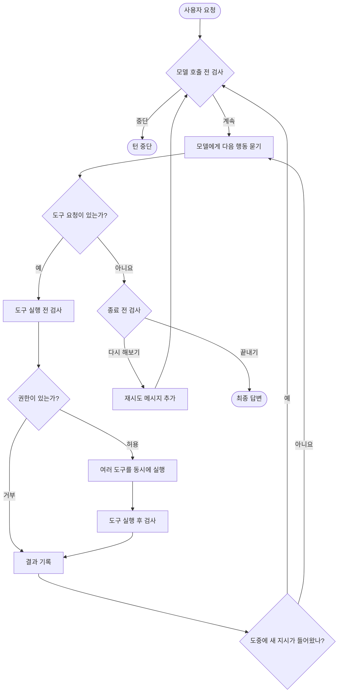
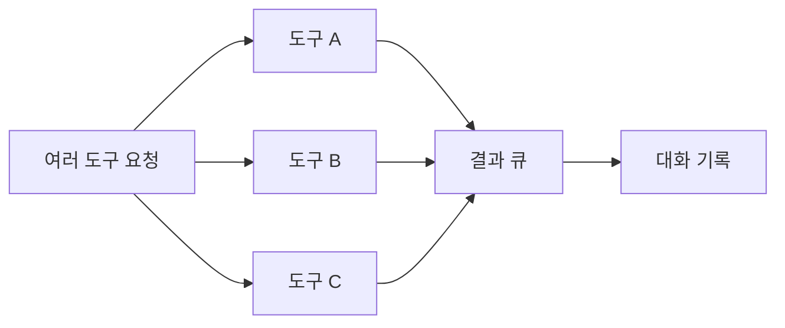

# Mistral Vibe: 검사 지점이 분명한 턴 루프

## 한 줄 요약

모델에게 묻기 전, 도구를 쓰기 전후, 턴을 끝내기 직전에 각각 끼어들 수 있는 검사 지점이 있다.

## 비유로 이해하기

공항 보안 절차와 비슷하다.

- 출발 전에 전체 상황을 확인한다.
- 위험할 수 있는 도구는 사용 전에 허가를 받는다.
- 사용한 뒤 결과를 기록한다.
- 모든 일이 끝나면 마지막 점검을 하고 출발한다.

## 전체 흐름

## 한 번의 반복에서 하는 일

1. **모델 호출 전 검사**

   미들웨어가 현재 작업을 계속해도 되는지 확인한다. 계획 모드 전환 같은 공통 정책을 이곳에 넣을 수 있다.

2. **모델 호출**

   모델이 일반 답변 또는 도구 요청을 만든다.

3. **도구 실행 전 검사**

   훅이 요청을 거부하거나, 실행할 도구와 입력값을 바꿀 수 있다.

4. **권한 확인**

   도구 권한은 항상 허용, 항상 거부, 매번 묻기 중 하나다.

5. **도구 실행 후 검사**

   실행 결과를 모으거나 가공한 뒤 모델이 읽을 수 있는 형태로 기록한다.

6. **종료 전 검사**

   아직 조건을 만족하지 못했다면 재시도 메시지를 넣고 같은 턴을 이어 간다.

## 여러 도구는 어떻게 실행할까?

모델이 여러 도구를 한꺼번에 요청하면 각각을 비동기 작업으로 시작한다. 결과는 큐를 통해 도착하는 순서대로 화면에 전달된다.

## 긴 대화와 새 지시 처리

- 대화가 너무 길어지면 내용을 압축하고 **같은 모델 호출을 다시 시도**한다. 이 복구는 일반 작업 단계 수를 소비하지 않는다.
- 사용자가 턴 도중 새 지시를 보내면 대기 목록에 넣는다. 현재 모델 호출이 끝나는 경계에서 꺼내 대화에 추가한다.
- 검토 모드처럼 중간 지시가 위험한 상황에서는 새 지시를 거부할 수 있다.

## 종료 조건

다음 조건이 모두 맞으면 끝난다.

- 모델이 더 이상 도구를 요청하지 않았다.
- 처리할 새 사용자 지시가 없다.
- 종료 전 훅이 재시도를 요청하지 않았다.

## 서브에이전트

`task` 도구가 별도 `AgentLoop`를 만들고 실행한다. 부모는 일반 도구 결과를 기다리듯 자식 에이전트가 끝날 때까지 기다린다.

## 이 구현에서 배울 점

- 개입 지점이 적고 역할이 명확해 확장하기 쉽다.
- 도구 실행 전 훅은 거부뿐 아니라 요청을 고칠 수도 있다.
- 긴 대화 복구와 일반 작업 반복을 구분해 불필요하게 작업 예산을 깎지 않는다.

## 기술 참고

| 역할 | 소스 |
|---|---|
| 전체 턴 진입 | `vibe/core/agent_loop/_loop.py`의 `act` |
| 반복 루프 | 같은 파일의 `_conversation_loop` |
| 모델 호출 | `_perform_llm_turn`, `_stream_assistant_events` |
| 도구 처리 | `_handle_tool_calls`, `_run_tools_concurrently`, `_execute_tool_call` |
| 권한 확인 | `_should_execute_tool`, `_ask_approval` |
| 훅 종류 | `vibe/core/hooks/models.py`의 `HookType` |
| 모델 호출 전 검사 | `vibe/core/middleware.py`의 `run_before_turn` |
| 서브에이전트 | `vibe/core/tools/builtins/task.py` |
