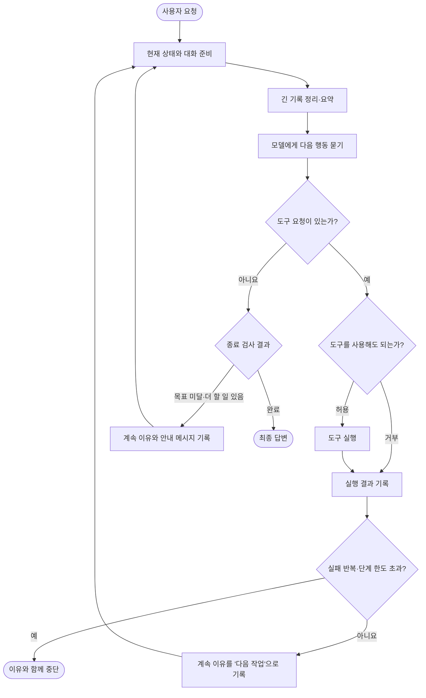
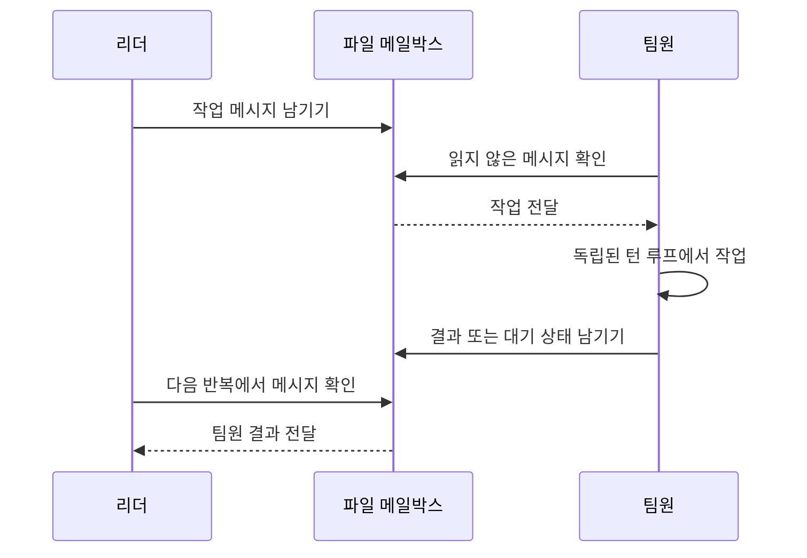

# OpenClaude: 계속할 이유를 상태로 관리하는 턴 루프

## 한 줄 요약

한 개의 큰 반복문 안에서 “왜 다시 도는지”와 “왜 끝나는지”를 명시적인 상태로 기록한다.

## 비유로 이해하기

프로젝트 매니저의 체크리스트와 비슷하다. 매 작업이 끝날 때마다 다음 중 하나를 적는다.

- 다음 작업으로 이동
- 대화가 길어서 요약 후 재시도
- 도구가 반복 실패해서 중단
- 목표가 덜 끝나서 계속
- 모든 조건을 만족해 완료

단순히 `continue`나 `break`만 쓰지 않고 이유를 남기기 때문에 복잡한 흐름을 추적하기 쉽다.

## 전체 흐름

## 반복 상태에는 무엇이 들어 있나?

상태는 대략 다음을 기억한다.

- 지금까지의 메시지
- 몇 번째 단계인지
- 직전에 다시 돈 이유
- 종료 훅 안에서 다시 들어온 상태인지
- 자동 압축이나 오류 복구를 이미 시도했는지
- 도구가 같은 방식으로 반복 실패하는지
- 남은 토큰과 단계 예산

이 정보 덕분에 “압축 실패 → 종료 훅 → 다시 압축 → 다시 실패” 같은 무한 반복을 끊을 수 있다.

## 모델을 부르기 전 대화를 줄이는 과정

OpenClaude는 한 번에 대화를 통째로 요약하지 않고, 작은 정리부터 큰 정리까지 순서대로 시도한다.

작은 손질로 충분하면 전체 요약을 피할 수 있다. 모델 호출 중 문맥 초과가 발생하면 제한된 횟수만 복구를 시도한다.

## 도구를 실행할 때

1. 이번 단계에서 실행 가능한 도구 수를 확인한다.
2. 사용자 또는 정책이 허용하는지 확인한다.
3. 실행 전 훅을 호출한다.
4. 도구를 실행한다.
5. 실행 후 훅을 호출한다.
6. 결과를 대화에 기록한다.
7. 같은 도구가 같은 이유로 반복 실패하는지 확인한다.

단계 한도에 도달하면 남은 도구를 무작정 실행하지 않고, 모델에게 현재까지의 내용을 요약하고 마무리하도록 요청한다.

## 모델이 답했는데도 계속하는 세 가지 이유

### 1. 종료 훅 또는 목표 검사

종료 훅이 “테스트가 아직 실패한다”처럼 부족한 점을 반환하면 그 내용을 새 메시지로 넣고 다시 모델을 호출한다.

### 2. 남은 토큰 예산

작업을 계속할 가치가 있고 예산이 남았다면 다음 행동을 이어 가도록 안내한다.

### 3. 모델의 “계속하겠다”는 표현

모델이 실제 도구 호출 없이 “이제 테스트하겠습니다”처럼 다음 행동을 예고하고 멈추면, 제한된 횟수 안에서 계속하라는 메시지를 넣는다.

세 경로 모두 반복 횟수 제한을 갖는다.

## 턴 도중 새 지시

새 명령은 `지금`, `다음`, `나중` 우선순위 큐에 들어간다. 현재 작업과 턴 사이의 안전한 경계에서 높은 우선순위부터 꺼낸다.

## 두 종류의 다른 에이전트

OpenClaude에는 서로 다른 협업 방식이 있다.

### 부모가 직접 시작한 자식

`AgentTool`로 자식 루프를 실행한다. 부모는 일반 도구처럼 자식이 끝날 때까지 기다리고 결과를 받는다.

### 독립적으로 움직이는 팀원

스웜의 팀원은 부모의 함수 안에서 실행되는 자식이 아니다. 각자 별도 세션으로 움직이고 파일 메일박스로 통신한다.

일반 결과 메시지는 다음 모델 호출의 첨부 정보로 들어간다. 권한, 계획 승인, 종료 요청처럼 구조화된 제어 메시지는 모델에게 보여 주지 않고 별도의 인박스 처리기가 담당한다.

팀원이 일을 마치고 종료하려 할 때, 대기 훅이 팀원을 살아 있게 유지할 수도 있다. 그러면 팀원은 새 메일박스 메시지를 기다렸다가 다음 작업을 받는다.

## 종료 조건

다음 순서로 확인한다.

1. 모델 또는 도구 오류로 끝내야 하는가?
2. 종료 훅이나 목표 검사가 계속을 요구하는가?
3. 토큰 예산상 더 진행해야 하는가?
4. “계속하겠다”는 신호가 있는가?
5. 단계 한도에 도달했는가?
6. 어느 조건에도 해당하지 않으면 완료한다.

## 이 구현에서 배울 점

- 복잡한 루프일수록 “계속/종료 이유”를 이름 있는 상태로 남기는 편이 안전하다.
- 압축, 재시도, 종료 훅 각각에 일회성 가드나 횟수 제한이 필요하다.
- 독립 팀원과 부모가 직접 기다리는 자식 에이전트는 통신 모델이 다르므로 구분해야 한다.

## 기술 참고

| 역할 | 소스 |
|---|---|
| 전체 반복 | `src/query.ts`의 `query`, `queryLoop` |
| 계속·종료 상태 | `src/query/transitions.ts` |
| 종료·목표·팀원 대기 훅 | `src/query/stopHooks.ts`의 `handleStopHooks` |
| 목표 평가 | `src/services/goal/controller.ts` |
| 도구 실행 | `src/services/tools/toolOrchestration.ts`, `toolExecution.ts` |
| 도구 전후 훅 | `src/services/tools/toolHooks.ts` |
| 새 명령 큐 | `src/utils/messageQueueManager.ts` |
| 팀원 메일박스 | `src/utils/teammateMailbox.ts` |
| 메일박스 제어 메시지 | `src/hooks/useInboxPoller.ts` |
| 일반 팀원 메시지 주입 | `src/utils/attachments.ts` |
| 부모-자식 실행 | `src/tools/AgentTool/runAgent.ts` |
