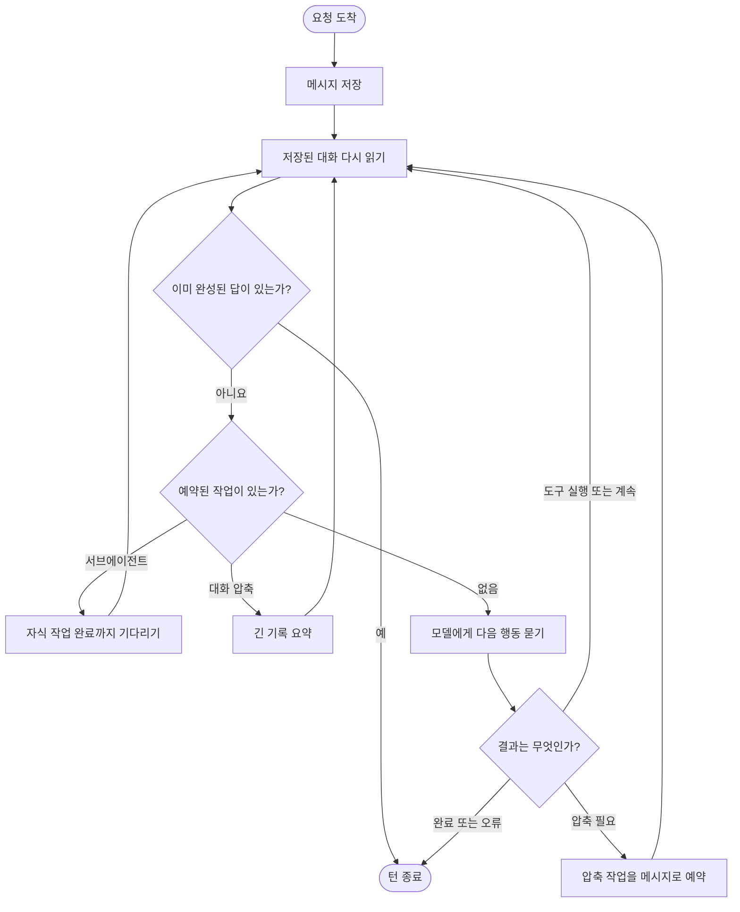
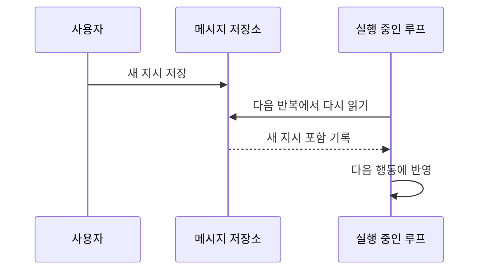

# OpenCode: 대화 기록을 다시 읽는 턴 루프

## 한 줄 요약

현재 상태를 별도 변수에 오래 들고 있기보다, 저장된 메시지를 매번 다시 읽어 다음 할 일을 정한다.

## 비유로 이해하기

교대 근무 일지와 비슷하다. 담당자는 매번 일지를 처음부터 확인해 “마지막으로 무엇을 했고, 아직 무엇이 남았는지”를 파악한 다음 일을 이어 간다.

이 방식은 한 번 더 읽는 비용이 들지만, 프로그램이 다시 시작되어도 기록만 남아 있으면 작업을 이어 가기 쉽다.

## 전체 흐름

## 왜 매번 다시 읽을까?

OpenCode에서 메시지는 단순한 화면 출력이 아니라 작업 상태다.

- 사용자의 새 지시가 저장되면 다음 반복에서 자연스럽게 발견한다.
- 대화 압축도 “나중에 처리할 작업”으로 기록한다.
- 서브에이전트 작업도 메시지의 일부로 기록한다.
- 중단 뒤 다시 시작해도 저장된 기록에서 진행 상황을 복원할 수 있다.

즉, 별도의 복잡한 스티어링 큐 없이도 메시지 저장소 자체가 작업 큐 역할을 한다.

## 한 번의 반복에서 하는 일

1. 세션을 작업 중 상태로 바꾼다.
2. 압축 경계 이후의 메시지를 읽는다.
3. 마지막 사용자 메시지, 마지막 에이전트 답변, 예약된 작업을 찾는다.
4. 이미 정상적으로 끝난 답변이 있으면 종료한다.
5. 서브에이전트나 압축 작업이 있으면 먼저 처리한다.
6. 없다면 모델을 호출하고 도구 결과를 저장한다.
7. 다시 처음으로 돌아가 저장된 상태를 재해석한다.

## 도구 사용과 안전장치

| 장치 | 쉬운 설명 |
|---|---|
| 권한 규칙 | 도구와 경로 패턴에 따라 허용, 거부, 사용자 확인을 선택한다. |
| 반복 감지 | 같은 도구와 같은 입력이 계속 반복되면 사용자에게 계속할지 묻는다. |
| 단계 한도 | 에이전트별 최대 단계에 가까워지면 마무리하라는 안내를 모델에 준다. |
| 재시도 | 일시적인 모델 오류는 정해진 정책에 따라 다시 시도한다. |
| 취소 정리 | 중단되더라도 작성 중인 답변과 세션 상태를 정리한다. |

## 턴 도중 새 입력

새 사용자 메시지는 바로 저장된다. 이미 실행 중인 루프를 새로 만들지 않고, 기존 루프가 다음 반복에서 메시지를 발견한다.

## 종료 조건

마지막 에이전트 메시지가 정상적으로 끝났고, 처리되지 않은 도구 요청이 없으며, 그 뒤에 새 사용자 메시지가 없으면 종료한다.

Codex나 OpenClaude처럼 종료 훅이 스스로 새 턴을 만드는 기능은 기본 구조에 없다. 더 이어 가려면 새 메시지나 플러그인 동작이 기록에 추가되어야 한다.

## 서브에이전트

예약된 `subtask`를 발견하면 부모 루프 안에서 자식 작업을 실행하고 완료를 기다린다. 자식 권한은 부모 세션 규칙과 합쳐진다. 완료 결과가 다시 메시지로 저장되면 부모 루프가 이어서 처리한다.

## 이 구현에서 배울 점

- 메시지 기록을 상태와 작업 큐로 함께 사용할 수 있다.
- 재시작과 중간 입력 처리에 강하다.
- 대신 매 단계에서 저장소를 읽고 쓰는 비용이 있다.

## 기술 참고

| 역할 | 소스 |
|---|---|
| 전체 반복 | `packages/opencode/src/session/prompt.ts`의 `runLoop` |
| 한 번의 모델 처리 | `packages/opencode/src/session/processor.ts`의 `process` |
| 실행 상태와 취소 | `packages/opencode/src/session/run-state.ts` |
| 서브에이전트 처리 | `packages/opencode/src/session/prompt.ts`의 `handleSubtask` |
| 대화 압축 | `packages/opencode/src/session/compaction.ts` |
| 권한 규칙 | `packages/opencode/src/permission/` |
