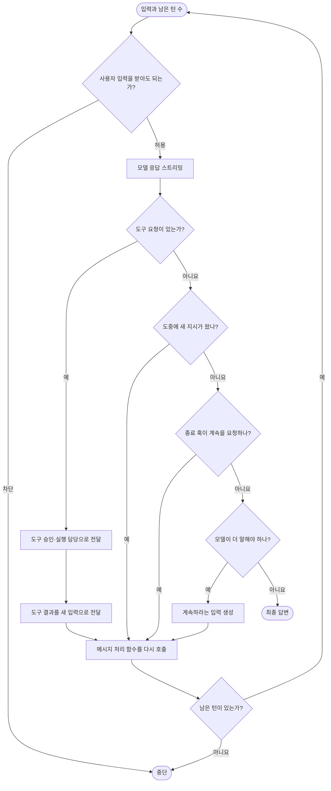
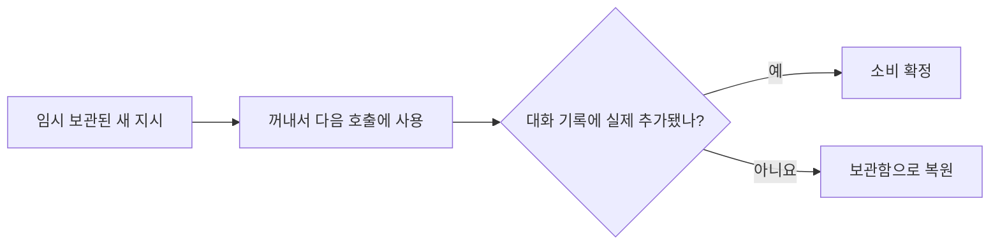

# Qwen Code: 다음 턴을 다시 호출하는 턴 루프

## 한 줄 요약

한 단계가 끝날 때마다 필요한 다음 입력을 정하고, 같은 메시지 처리 함수를 다시 호출해 작업을 이어 간다.

## 비유로 이해하기

릴레이 달리기와 비슷하다. 한 주자가 자기 구간을 마치면 다음 주자에게 바통과 남은 횟수를 넘긴다. 도구 결과, 새 사용자 지시, 종료 훅의 요청이 각각 다음 바통이 될 수 있다.

## 전체 흐름

## 역할이 나뉘어 있다

Qwen Code에서는 모델 스트리밍과 도구 실행이 한 함수 안에서 모두 끝나지 않는다.

1. `Turn.run`은 모델의 글과 도구 요청을 읽어 이벤트로 내보낸다.
2. 상위 실행기가 도구 요청을 스케줄러에 전달한다.
3. 스케줄러가 권한을 확인하고 도구를 실행한다.
4. 도구 결과를 새로운 입력으로 메시지 처리 함수에 다시 보낸다.

덕분에 화면, IDE 연결, 백그라운드 서비스가 같은 모델 처리 코어를 공유할 수 있다.

## 도구 승인

도구 스케줄러는 여러 단계의 규칙을 합쳐 최종 결정을 내린다.

- **허용**: 바로 실행한다.
- **거부**: 실행하지 않고 거부 결과를 만든다.
- **사용자 확인**: 승인 대기 상태로 바꾸고 답을 기다린다.

자동 실행 모드와 계획 모드도 이 단계에서 반영된다. 특히 계획 모드의 팀원 에이전트는 리더가 승인하기 전까지 제한된 도구만 사용할 수 있다.

## 모델이 도구를 요청하지 않았을 때

바로 끝내기 전에 세 가지를 순서대로 확인한다.

1. **새 사용자 지시**

   진행 중 들어온 지시가 있으면 다음 호출의 입력으로 사용한다.

2. **종료 훅**

   목표가 아직 끝나지 않았다고 판단하면 이유를 넣어 다시 호출한다.

3. **다음 화자 검사**

   별도의 모델 판단으로 “에이전트가 더 말해야 한다”는 결과가 나오면 “계속해 주세요”에 해당하는 입력을 만들어 다시 호출한다.

이 경로들은 작업이 끝없이 이어지지 않도록 전체 턴 예산, 종료 훅 반복 한도, 반복 감지기를 함께 사용한다.

## 새 지시를 안전하게 처리하는 법

턴 도중 들어온 지시는 먼저 임시 보관함에서 꺼내 사용한다. 호출이 실제 대화 기록에 반영되었으면 확정하고, 압축이나 오류 때문에 반영되지 않았다면 다시 보관함에 돌려놓는다.

단순히 대화 길이를 비교하지 않고 “사용자 내용이 추가된 횟수”를 확인한다. 대화 압축이 길이를 줄여도 새 지시가 실제로 들어갔는지 판별하기 위해서다.

## 긴 대화 처리

채팅 계층이 대화를 자동으로 압축한다. 압축 이벤트가 발생하면 시작 컨텍스트를 복구하고, “압축된 세션이 다시 시작됨”을 알리는 훅을 실행한다.

## 서브에이전트와 팀원 메시지

- 부모가 `Task` 도구로 시작한 자식은 완료될 때까지 기다린다.
- 독립 팀원이 보낸 메시지는 `Teammate` 입력 유형으로 새 턴을 만든다.
- 계획 모드에서 팀원의 도구 승인 요청은 리더의 결정과 연결된다.

## 이 구현에서 배울 점

- 모델 스트리밍과 도구 실행을 분리하면 여러 실행 환경이 같은 코어를 쓰기 쉽다.
- 반복을 재귀 호출로 표현할 때는 남은 예산을 모든 경로에 정확히 전달해야 한다.
- 임시 입력은 “꺼냈다”가 아니라 “대화에 실제 반영됐다”를 확인한 뒤 삭제해야 한다.

## 기술 참고

| 역할 | 소스 |
|---|---|
| 메시지 처리와 재귀 연결 | `packages/core/src/core/client.ts`의 `GeminiClient.sendMessageStream` |
| 한 번의 모델 스트림 | `packages/core/src/core/turn.ts`의 `Turn.run` |
| 도구 승인·실행 | `packages/core/src/core/coreToolScheduler.ts` |
| 다음 화자 판단 | `packages/core/src/utils/nextSpeakerChecker.ts` |
| 대화 기록과 자동 압축 | `packages/core/src/core/geminiChat.ts` |
| 훅 요청·응답 | `MessageBus`의 `HOOK_EXECUTION_REQUEST`, `HOOK_EXECUTION_RESPONSE` |
