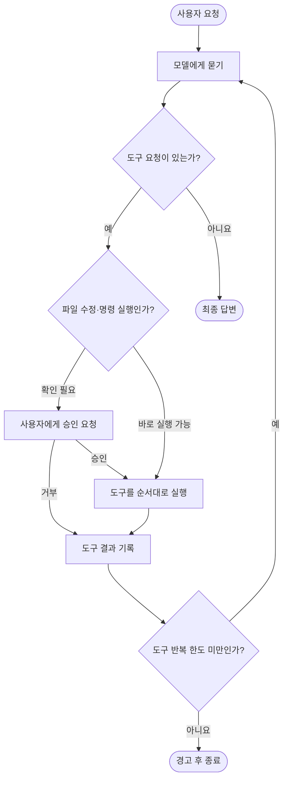
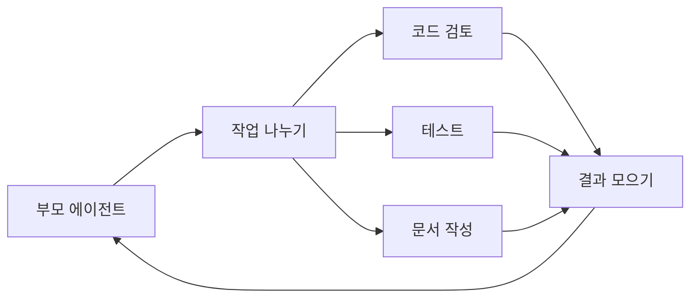

# zai-glm-cli: 가장 단순한 턴 루프

## 한 줄 요약

모델이 도구를 요청하면 실행하고 다시 모델에게 묻는다. 도구 요청이 없으면 그 답을 최종 답으로 사용한다.

## 비유로 이해하기

요리사가 조리법을 한 단계씩 말하고, 조수가 그대로 실행한다고 생각하면 된다.

- 요리사가 “양파를 썰어”라고 하면 조수가 실행한다.
- 실행 결과를 알려 주면 요리사가 다음 단계를 말한다.
- 요리사가 완성된 요리를 내놓으면 작업이 끝난다.

## 전체 흐름

## 단계별로 보기

1. 사용자 메시지를 대화 기록에 넣는다.
2. 대화 기록과 사용할 수 있는 도구 목록을 모델에 보낸다.
3. 모델이 도구를 요청하면 하나씩 실행한다.
4. 실행 결과를 대화 기록에 넣고 다시 모델에 보낸다.
5. 모델이 도구 없이 답하면 턴을 끝낸다.

스트리밍 모드도 원리는 같다. 다만 글이 만들어지는 동안 화면에 조금씩 보여 주고, 도구 요청 조각을 모아 완성된 요청으로 만든다.

## 안전장치

| 장치 | 동작 |
|---|---|
| 사용자 확인 | 파일 변경과 셸 명령은 도구 내부에서 확인할 수 있다. |
| 반복 한도 | 도구를 최대 400라운드까지 실행한다. |
| 취소 | 각 반복과 도구 실행 전에 취소 신호를 확인한다. |

다른 에이전트와 달리 별도의 종료 훅, 자동 대화 압축, 턴 도중 새 지시 받기는 제공하지 않는다. 그래서 구조는 이해하기 쉽지만 복잡한 장기 작업을 제어하는 기능은 적다.

## 서브에이전트

`TaskOrchestrator`는 여러 전문 에이전트를 순서대로 또는 동시에 실행할 수 있다. 부모는 자식이 끝날 때까지 기다린 뒤 결과를 합친다. 별도 메일박스나 상태 채널은 없다.

## 이 구현에서 배울 점

- 턴 루프의 최소 형태를 가장 분명하게 보여 준다.
- “도구 요청이 있으면 반복, 없으면 종료”가 기본 뼈대다.
- 고급 기능은 결국 이 뼈대의 앞뒤에 검사와 메시지 통로를 추가한 것이다.

## 기술 참고

| 역할 | 소스 |
|---|---|
| 일반 응답 루프 | `src/agent/zai-agent.ts`의 `processUserMessage` |
| 스트리밍 응답 루프 | `src/agent/zai-agent.ts`의 `processUserMessageStreaming` |
| 도구 분배 | `src/agent/zai-agent.ts`의 `executeTool` |
| 스트림에서 도구 요청 조립 | `src/agent/stream-processor.ts`의 `StreamProcessor.process` |
| 사용자 확인 | `ConfirmationTool` |
| 서브에이전트 실행 | `src/agents/task-orchestrator.ts`의 `TaskOrchestrator` |
